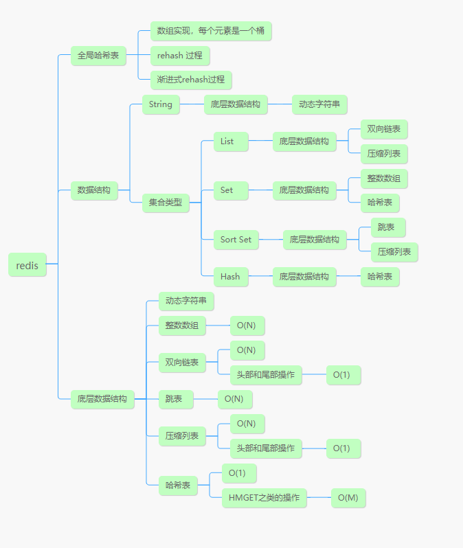

# Redis数据结构

## 总览




## Redis 数据类型和底层数据结构的对应关系


## 底层数据结构

### 全局哈希表

#### 什么是全局哈希表

为了实现从键到值的快速访问，Redis 使用了一个哈希表来保存所有键值对。一个哈希表，其实就是一个数组，数组的每个元素称为一个哈希桶.

哈希桶中的元素保存的并不是值本身，而是指向具体值的指针。这也就是说，不管值是 String，还是集合类型，哈希桶中的元素都是指向它们的指针.

哈希桶中的 entry 元素中保存了key和value指针，分别指向了实际的键和值，这样一来，即使值是一个集合，也可以通过value指针被查找到.


因为这个哈希表保存了所有的键值对，所以，我也把它称为全局哈希表。哈希表的最大好处很明显，就是让我们可以用 O(1) 的时间复杂度来快速查找到键值对——我们只需要计算键的哈希值，就可以知道它所对应的哈希桶位置，然后就可以访问相应的 entry 元素。

这个查找过程主要依赖于哈希计算，和数据量的多少并没有直接关系。也就是说，不管哈希表里有 10 万个键还是 100 万个键，我们只需要一次计算就能找到相应的键。

#### 哈希表key hash 冲突

所谓hash 冲突，就是会有一部分key计算出来的hash 值对应的是同一个桶的位置，那么久会被分配到相同的桶下，如果不做处理，就出现冲突，负载之前的key，redis 采用了 链式哈希来解决这个问题，也就当出现hash 冲突的时候，会将桶”变成“一个由多个entry组成的链表，它们之间用指针相连。

所以当进行查找的时候，需要卓一比较链表的元素的key 是不是一样，如果链表很长，延迟就会增到。


#### rehash 过程

为了解决链表过长，导致查询会耗时的问题，redis 会对全局哈希表，进行rehash ，也就是扩容原来哈希表的大小，增加桶的数量，来让entry分布的更加均匀，减少桶链表的长度，进而提高查询的速度。

redis 会准备两个哈希表，哈希表1，哈希表2，一开始的时候，会使用哈希表1，此时哈希表2 并没有分配空间，随着数据量的逐渐增多，redis 会进行rehash：

1. 给哈希表 2 分配更大的空间，例如是当前哈希表 1 大小的两倍；
2. 把哈希表 1 中的数据重新映射并拷贝到哈希表 2 中；
3. 释放哈希表 1 的空间。

到此，我们就可以从哈希表 1 切换到哈希表 2，用增大的哈希表 2 保存更多数据，而原来的哈希表 1 留作下一次 rehash 扩容备用。

这个过程看似简单，但是第二步涉及大量的数据拷贝，如果一次性把哈希表 1 中的数据都迁移完，会造成 Redis 线程阻塞，无法服务其他请求。此时，Redis 就无法快速访问数据了。为了避免这个问题，Redis 采用了**渐进式 rehash**。简单来说就是在第二步拷贝数据时，Redis 仍然正常处理客户端请求，每处理一个请求时，从哈希表 1 中的第一个索引位置开始，顺带着将这个索引位置上的所有 entries 拷贝到哈希表 2 中；等处理下一个请求时，再顺带拷贝哈希表 1 中的下一个索引位置的 entries。


这样就巧妙地把一次性大量拷贝的开销，分摊到了多次处理请求的过程中，避免了耗时操作，保证了数据的快速访问。

**注意**：


**rehash 只是增加的桶的数量，桶内的key value 指针 的地址并没有发生变化**


渐进式rehash执行时，除了根据键值对的操作来进行数据迁移，Redis本身还会有一个定时任务在执行rehash，如果没有键值对操作时，这个定时任务会周期性地（例如每100ms一次）搬移一些数据到新的哈希表中，这样可以缩短整个rehash的过程。


在进行渐进式 rehash 的过程中， 字典会同时使用 ht[0] 和 ht[1] 两个哈希表， 所以在渐进式 rehash 进行期间， 字典的删除（delete）、查找（find）、更新（update）等操作会在两个哈希表上进行： 比如说， 要在字典里面查找一个键的话， 程序会先在 ht[0] 里面进行查找， 如果没找到的话， 就会继续到 ht[1] 里面进行查找， 诸如此类。

另外， 在渐进式 rehash 执行期间， 新添加到字典的键值对一律会被保存到 ht[1] 里面， 而 ht[0] 则不再进行任何添加操作： 这一措施保证了 ht[0] 包含的键值对数量会只减不增， 并随着 rehash 操作的执行而最终变成空表。

### 哈希表

### 双向链表

### 跳表

### 压缩链表

压缩链表是一种专门为了提升内存使用效率而设计的，经过特殊编码的双端链表数据结构。 既可以用来保存整形数值，也可以用来保存字符串数值，为了节约内存，同时也是体现压缩之含义， 当保存一个整形数值时，压缩链表会使用一个真正的整形数来保存，而不是使用字符串的形式来存储。 这一点很容易理解，一个整数可以根据其数值的大小使用1个字节，2个字节，4个字节或者8个字节来表示， 如果使用字符串的形式来存储的话，其所需的字节数大小一定不小于使用整形数所需的字节数。

压缩链表允许在链表两端以 *O(1)* 的时间复杂度执行 *Pop* 或者 *Push* 操作，当然这只是一种理想状态下的情况， 由于压缩链表实际上是内存中一段连续分配的内存，因此这些操作需要对压缩链表所使用的内存进行重新分配， 所以其真实的时间复杂度是和链表所使用的内存大小相关的。

压缩链表与经典双端链表最大的区别在于，双端链表的节点是分散在内存中并不是连续的，压缩链表中所有的数据都是存储在一段连续的内存之中的。


#### 表头

表头包括四个部分，分别是内存字节数zlbytes，尾节点距离起始地址的字节数zltail_offset，节点数量zllength，标志结束的记号zlend。

- zlbytes：记录整个压缩列表占用的内存字节数。该字段固定是一个四字节的无符号整数，用于表示整个压缩链表所占用内存的长度（以字节为单位），这个长度数值是包含这个`<zlbytes>`本身的。
- zltail_offset：记录压缩列表尾节点距离压缩列表的起始地址的字节数`（目的是为了直接定位到尾节点，方便反向查询）`。该字段固定是一个四字节的无符号整数，用于表示在链表中最后一个节点的偏移字节量，借助这个字段，我们不需要遍历整个链表便可以在链表尾部执行*Pop*操作
- zllength：记录了压缩列表的节点数量。即在上图中节点数量为3。该字段固定是一个两个字节的无符号整数，用于表示链表中节点的个数。但是该字段最多只能表示`2^16-2`个节点个数；超过这个数量，也就是该字段被设置为`2^16-1`时， 意味着我们需要遍历整个链表，才可以获取链表中节点真实的数量。
- zlend：保存一个常数255(0xFF)，标记压缩列表的末端。该字段可以被认为是一个特殊的`<entry>`节点，用作压缩链表的结束标记，只有一个字节，存储着`0xFF`，一旦我们遍历到这个特殊的标记，便意味着我们完成了对这个压缩链表的遍历。

#### 数据节点

数据节点包括三个部分，分别是前一个节点的长度prev_entry_len，当前数据类型和编码格式encoding，具体数据指针value。

- prev_entry_len：记录前驱节点的长度。
- encoding：记录当前数据类型和编码格式。
- value：存放具体的数据

为了节省空间，entry做了很多的优化工作。

prev_entry_len ， 这个字段标记了该节点的前序节点的长度，以便我们可以向链表的头部反向遍历链表。

1. 当前节点的前序节点的长度为0到253个字节时，`<prevlen>`字段只需要一个8位的无符号整数，也就是一个字节，便可以编码对应的长度。
2. 当前节点的前序节点的长度大于等于254个字节时，`<prevlen>`字段则需要5个字节，其中第一个字节会被设置成`0xFE`也就是254， 这是一个特殊标记，用于表明，这里保存了一个比较大的数值，需要继续读取后续的4个字节以解码出前序节点的长度。 而为什么不选择`0xFF`作为特殊标记的原因在于，`0xFF`是整个链表结束的标记。

enconding, 这个字段用于表示该节点使用的编码方式，具体是按照整形数进行编码还是按照字符串进行编码， 当节点使用的是字符串编码时，该字段还会指明字符串数据的字节长度。

当`<encoding>`字段首字节的前两个比特都为1的时候，也就是出现`[11XXXXXX]`这样的情况时，表明当前节点是使用整形数进行编码的

当`<encoding>`字段首字节的前两个比特不是`11`的情况时，则表明该节点的数据是以字符串的形式进行编码的。


## 数据结构的时间复杂度

记住下面四条总结：

- 单元素操作是基础；
- 范围操作非常耗时；
- 统计操作通常高效；
- 例外情况只有几个。


# Redis IO 模式

## 为什么redis要采用单线程？


## 多线程的开销	

## 单线程的redis 为啥快


# 持久化


## 总览


## AOF

aof 是写后日志，也就是先执行redis 命令，执行成功后，在执行写入日志。


### 日志格式

aof 日志内存储的是具体的命令，以文本的形式存储

例如 set key value

*3 代表当前命令由三个部分组成，每部分都是由“$+数字”开头，后面紧跟着具体的命令、键或值。这里，“数字”表示这部分中的命令、键或值一共有多少字节。例如，“$3 set”表示这部分有 3 个字节，也就是“set”命令。

为了避免额外的语法检查开销，写日志时候，并不会先去对命令语法进行检查，而是先执行命令，成功了，就说明没有语法错误，就写入日志，返回错误，就不会写入日志了。

还有执行之后，再进行写入日志，不会阻塞当前的写操作。


### 写入日志的策略

AOF 机制给我们提供了三个选择，也就是 AOF 配置项 appendfsync 的三个可选值。

- Always，同步写回：每个写命令执行完，立马同步地将日志写回磁盘；
- Everysec，每秒写回：每个写命令执行完，只是先把日志写到 AOF 文件的内存缓冲区，每隔一秒把缓冲区中的内容写入磁盘；
- No，操作系统控制的写回：每个写命令执行完，只是先把日志写到 AOF 文件的内存缓冲区，由操作系统决定何时将缓冲区内容写回磁盘。

三种策略优缺点：

- “同步写回”可以做到基本不丢数据，但是它在每一个写命令后都有一个慢速的落盘操作，不可避免地会影响主线程性能；
- “操作系统控制的写回”在写完缓冲区后，就可以继续执行后续的命令，但是落盘的时机已经不在 Redis 手中了，只要 AOF 记录没有写回磁盘，一旦宕机对应的数据就丢失了；
- “每秒写回”采用一秒写回一次的频率，避免了“同步写回”的性能开销，虽然减少了对系统性能的影响，但是如果发生宕机，上一秒内未落盘的命令操作仍然会丢失。所以，这只能算是，在避免影响主线程性能和避免数据丢失两者间取了个折中。


### AOF 日志重写

随着接收的写命令越来越多，AOF 文件会越来越大。这也就意味着，我们一定要小心 AOF 文件过大带来的性能问题。

这里的“性能问题”，主要在于以下三个方面：

- 一是，文件系统本身对文件大小有限制，无法保存过大的文件；
- 二是，如果文件太大，之后再往里面追加命令记录的话，效率也会变低；
- 三是，如果发生宕机，AOF 中记录的命令要一个个被重新执行，用于故障恢复，如果日志文件太大，整个恢复过程就会非常缓慢，这就会影响到 Redis 的正常使用。

所谓重新就是aof 日志变小。

为什么重写机制可以把日志文件变小呢? 实际上，重写机制具有“多变一”功能。所谓的“多变一”，也就是说，旧日志文件中的多条命令，在重写后的新日志中变成了一条命令


## RDB


# 主从

## 总览

​	


# 哨兵模式

## 总览


# 实战


## String


## 聚合统计


## GEO

## 时间序列

## 消息队列

## 影响redis 性能的因素


## CPU 对redis 性能的影响

## redis 慢了


## 内存

## 缓冲区

## 旁路缓存

## 淘汰策略

## 原子操作

## ACID

## 分布式锁

## 主从同步的坑

## 脑裂

## 分布式锁

## 分布式限流

## 秒杀扣减库存


## 数据量倾斜

这主要有三个原因，分别是某个实例上保存了 bigkey、Slot 分配不均衡以及 Hash Tag。

### bigkey 导致倾斜

第一个原因是，某个实例上正好保存了 bigkey。bigkey 的 value 值很大（String 类型），或者是 bigkey 保存了大量集合元素（集合类型），会导致这个实例的数据量增加，内存资源消耗也相应增加。

而且，bigkey 的操作一般都会造成实例 IO 线程阻塞，如果 bigkey 的访问量比较大，就会影响到这个实例上的其它请求被处理的速度。

为了避免 bigkey 造成的数据倾斜，一个根本的应对方法是，我们在业务层生成数据时，要尽量避免把过多的数据保存在同一个键值对中。

此外，如果 bigkey 正好是集合类型，我们还有一个方法，就是把 bigkey 拆分成很多个小的集合类型数据，分散保存在不同的实例上。

### Slot 分配不均衡导致倾斜

如果集群运维人员没有均衡地分配 Slot，就会有大量的数据被分配到同一个 Slot 中，而同一个 Slot 只会在一个实例上分布，这就会导致，大量数据被集中到一个实例上，造成数据倾斜。

不同集群上查看 Slot 分配情况的方式不同：如果是 Redis Cluster，就用 CLUSTER SLOTS 命令查看slot 分布情况

```shell

127.0.0.1:6379> cluster slots
1) 1) (integer) 0
   2) (integer) 4095
   3) 1) "192.168.10.3"
      2) (integer) 6379
2) 1) (integer) 12288
   2) (integer) 16383
   3) 1) "192.168.10.5"
      2) (integer) 6379
```

### Hash Tag 导致倾斜

Hash Tag 是指加在键值对 key 中的一对花括号{}。这对括号会把 key 的一部分括起来，客户端在计算 key 的 CRC16 值时，只对 Hash Tag 花括号中的 key 内容进行计算。如果没用 Hash Tag 的话，客户端计算整个 key 的 CRC16 的值。

举个例子，假设 key 是 user:profile:3231，我们把其中的 3231 作为 Hash Tag，此时，key 就变成了 user:profile:{3231}。当客户端计算这个 key 的 CRC16 值时，就只会计算 3231 的 CRC16 值。否则，客户端会计算整个“user:profile:3231”的 CRC16 值。

使用 Hash Tag 的好处是，如果不同 key 的 Hash Tag 内容都是一样的，那么，这些 key 对应的数据会被映射到同一个 Slot 中，同时会被分配到同一个实例上。

## 数据访问倾斜

发生数据访问倾斜的根本原因，就是实例上存在热点数据（比如新闻应用中的热点新闻内容、电商促销活动中的热门商品信息，等等）。一旦热点数据被存在了某个实例中，那么，这个实例的请求访问量就会远高于其它实例，面临巨大的访问压力。

###  热点数据多副本

如果是只读服务的key ，采用 **热点数据多副本 ** 的方法来应对。

这个方法的具体做法是，我们把热点数据复制多份，在每一个数据副本的 key 中增加一个随机前缀，让它和其它副本数据不会被映射到同一个 Slot 中。这样一来，热点数据既有多个副本可以同时服务请求，同时，这些副本数据的 key 又不一样，会被映射到不同的 Slot 中。在给这些 Slot 分配实例时，我们也要注意把它们分配到不同的实例上，那么，热点数据的访问压力就被分散到不同的实例上了。

### 多级缓存

对于只读热点数据来说，增加多级缓存。

例如可以增加本地cache ，来抗住热点key 到redis ，减少redis 的压力。


## 缓存异常

### 雪崩

需要设计key 失效时间 + 随机时间

### 击穿

就是热点key 失效，流量到达了后端数据库，会把数据库打垮

定时延长热点key 失效时间，或者设置为不失效

采用分布式锁，此时只有一个线程会去库取数据。其他线程等待，过一会再去reids 内去取

### 穿透

设置空值或者特殊值，到redis 。

bloomfilter 。


## 通信开销


# Redis6.0 多线程 客户端缓存 安全

# Reids 常用工具


