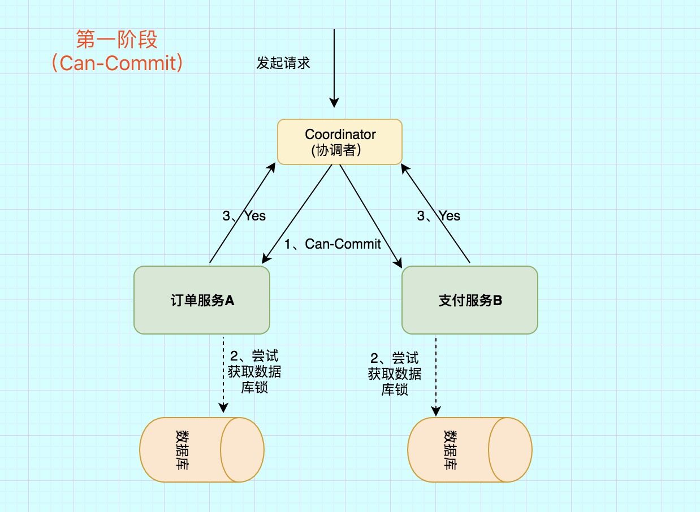
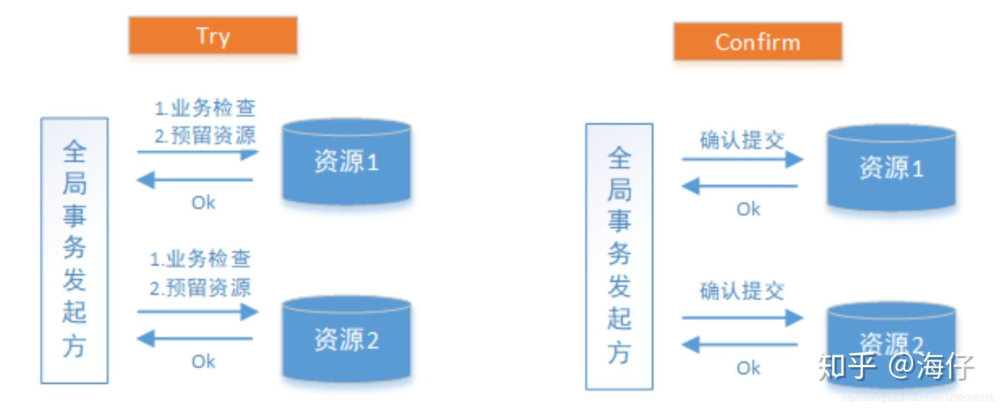

## 介绍

分布式事务关注的是分布式场景下如何处理事务，是指事务的参与者、支持事务操作的服务器、存储等资源分别位于分布式系统的不同节点之上。

简单来说，分布式事务就是一个业务操作，是由多个细分操作完成的，而这些细分操作又分布在不同的服务器上；事务，就是这些操作要么全部成功执行，要么全部不执行。

## 数据库事务

### 数据库特性

数据库事务的特性包括原子性（Atomicity）、一致性（Consistency）、隔离性（Isolation）和持久性（Durabilily），简称 ACID。

- 原子性（Atomicity），可以理解为一个事务内的所有操作要么都执行，要么都不执行。
- 一致性（Consistency），可以理解为数据是满足完整性约束的，也就是不会存在中间状态的数据，比如你账上有400，我账上有100，你给我打200块，此时你账上的钱应该是200，我账上的钱应该是300，不会存在我账上钱加了，你账上钱没扣的**中间状态**。
- 隔离性（Isolation），指的是多个事务并发执行的时候不会互相干扰，即一个事务内部的数据对于其他事务来说是隔离的。
- 持久性（Durability），指的是一个事务完成了之后数据就被永远保存下来，之后的其他操作或故障都不会对事务的结果产生影响。

在数据库执行中，多个并发执行的事务如果涉及到同一份数据的读写就容易出现数据不一致的情况，不一致的异常现象有以下几种。

> 脏读

是指一个事务中访问到了另外一个事务未提交的数据。例如事务 T1 中修改的数据项在尚未提交的情况下被其他事务（T2）读取到，如果 T1 进行回滚操作，则 T2 刚刚读取到的数据实际并不存在。

> 不可重复读

是指一个事务读取同一条记录 2 次，得到的结果不一致。例如事务 T1 第一次读取数据，接下来 T2 对其中的数据进行了更新或者删除，并且 Commit 成功。这时候 T1 再次读取这些数据，那么会得到 T2 修改后的数据，发现数据已经变更，这样 T1 在一个事务中的两次读取，返回的结果集会不一致。


> 幻读

是指一个事务读取 2 次，得到的记录条数不一致。例如事务 T1 查询获得一个结果集，T2 插入新的数据，T2 Commit 成功后，T1 再次执行同样的查询，此时得到的结果集记录数不同。

### 数据库的隔离级别

SQL 标准根据三种不一致的异常现象，将隔离性定义为四个隔离级别（Isolation Level），隔离级别和数据库的性能呈反比，隔离级别越低，数据库性能越高；而隔离级别越高，数据库性能越差。

> Read uncommitted 读未提交

在该级别下，一个事务对数据修改的过程中，不允许另一个事务对该行数据进行修改，但允许另一个事务对该行数据进行读，不会出现更新丢失，但会出现脏读、不可重复读的情况。

> Read committed 读已提交
>

在该级别下，未提交的写事务不允许其他事务访问该行，不会出现脏读，但是读取数据的事务允许其他事务访问该行数据，因此会出现不可重复读的情况。

> Repeatable read 可重复读

在该级别下，在同一个事务内的查询都是和事务开始时刻一致的，保证对同一字段的多次读取结果都相同，除非数据是被本身事务自己所修改，不会出现同一事务读到两次不同数据的情况。因为没有约束其他事务的新增Insert操作，所以 SQL 标准中可重复读级别会出现幻读。

值得一提的是，可重复读是 MySQL InnoDB 引擎的默认隔离级别，但是在 MySQL 额外添加了间隙锁（Gap Lock），可以防止幻读。

> Serializable 序列化
>

该级别要求所有事务都必须串行执行，可以避免各种并发引起的问题，效率也最低。


## 2PC

https://www.cnblogs.com/qdhxhz/p/11167025.html

两阶段提交又称**2PC**,2PC是一个非常经典的`强一致、中心化的原子提交协议`。

这里所说的中心化是指协议中有两类节点：一个是中心化`协调者节点`（coordinator）和`N个参与者节点`（partcipant）。

`两个阶段`：第一阶段：**投票阶段** 和第二阶段：**提交/执行阶段**。

`举例` **订单服务A**，需要调用 **支付服务B** 去支付，支付成功则处理购物订单为待发货状态，否则就需要将购物订单处理为失败状态。

那么看2PC阶段是如何处理的

### 第一阶段：投票阶段


第一阶段主要分为3步

1）`事务询问`

**协调者** 向所有的 **参与者** 发送**事务预处理请求**，称之为**Prepare**，并开始等待各 **参与者** 的响应。

2）`执行本地事务`

各个 **参与者** 节点执行本地事务操作,但在执行完成后并**不会真正提交数据库本地事务**，而是先向 **协调者** 报告说：“我这边可以处理了/我这边不能处理”。.

3）`各参与者向协调者反馈事务询问的响应`

如果 **参与者** 成功执行了事务操作,那么就反馈给协调者 **Yes** 响应,表示事务可以执行,如果没有 **参与者** 成功执行事务,那么就反馈给协调者 **No** 响应,表示事务不可以执行。

第一阶段执行完后，会有两种可能。1、所有都返回Yes. 2、有一个或者多个返回No。

### 第二阶段：提交/执行阶段（成功流程）

`成功条件`：所有参与者都返回Yes。


第二阶段主要分为两步

 1)`所有的参与者反馈给协调者的信息都是Yes,那么就会执行事务提交`

 **协调者** 向 **所有参与者** 节点发出Commit请求.

 2)`事务提交`

 **参与者** 收到Commit请求之后,就会正式执行本地事务Commit操作,并在完成提交之后释放整个事务执行期间占用的事务资源。

### 第二阶段：提交/执行阶段（异常流程）

`异常条件`：任何一个 **参与者** 向 **协调者** 反馈了 **No** 响应,或者等待超时之后,协调者尚未收到所有参与者的反馈响应。


异常流程第二阶段也分为两步

1)`发送回滚请求`

 **协调者** 向所有参与者节点发出 **RoollBack** 请求.

 2)`事务回滚`

 **参与者** 接收到RoollBack请求后,会回滚本地事务。


### 2PC缺点

在第二阶段中，假设协调者发出了事务 Commit 的通知，但是由于网络问题该通知仅被一部分参与者所收到并执行 Commit，其余的参与者没有收到通知，一直处于阻塞状态，那么，这段时间就产生了数据的不一致性。


通过上面的演示，很容易想到2pc所带来的缺陷

1）`性能问题`

无论是在第一阶段的过程中,还是在第二阶段,**所有的参与者资源和协调者资源都是被锁住的**,只有当所有节点准备完毕，事务 **协调者** 才会通知进行全局提交，

**参与者** 进行本地事务提交后才会释放资源。这样的**过程会比较漫长，对性能影响比较大**。

2）`单节点故障`

由于**协调者**的重要性，一旦 **协调者** 发生故障。**参与者** 会一直阻塞下去。尤其在第二阶段，**协调者** 发生故障，那么所有的 **参与者** 还都处于

锁定事务资源的状态中，而无法继续完成事务操作。（虽然协调者挂掉，可以重新选举一个协调者，但是无法解决因为协调者宕机导致的参与者处于阻塞状态的问题）

**2PC出现单点问题的三种情况**

(1)`协调者正常,参与者宕机`

 由于 **协调者** 无法收集到所有 **参与者** 的反馈，会陷入阻塞情况。

 **解决方案**:引入超时机制,如果协调者在超过指定的时间还没有收到参与者的反馈,事务就失败,向所有节点发送终止事务请求。

(2)`协调者宕机,参与者正常`

 无论处于哪个阶段，由于**协调者宕机**，无法发送提交请求，所有处于执行了操作但是未提交状态的参与者都会陷入阻塞情况.

 **解决方案**:引入协调者备份,同时协调者需记录操作日志.当检测到协调者宕机一段时间后，协调者备份取代协调者，并读取操作日志，向所有参与者询问状态。

(3)`协调者和参与者都宕机`

1. **发生在第一阶段**： 因为第一阶段，所有参与者都没有真正执行commit，所以只需重新在剩余的参与者中重新选出一个协调者，新的协调者在重新执行第一阶段和第二阶段就可以了。

2)**发生在第二阶段 并且 挂了的参与者在挂掉之前没有收到协调者的指令**。也就是上面的第4步挂了，这是可能协调者还没有发送第4步就挂了。这种情形下，新的协调者重新执行第一阶段和第二阶段操作。

3)**发生在第二阶段 并且 有部分参与者已经执行完commit操作**。就好比这里订单服务A和支付服务B都收到**协调者** 发送的commit信息，开始真正执行本地事务commit,但突发情况，Acommit成功，B确挂了。这个时候目前来讲数据是不一致的。虽然这个时候可以再通过手段让他和协调者通信，再想办法把数据搞成一致的，但是，这段时间内他的数据状态已经是不一致的了！ 2PC 无法解决这个问题。


## 3PC

https://www.cnblogs.com/qdhxhz/p/11167025.html

三阶段提交协议（3PC）主要是为了解决两阶段提交协议的阻塞问题，2pc存在的问题是当协作者崩溃时，参与者不能做出最后的选择。因此参与者可能在协作者恢复之前保持阻塞。三阶段提交（Three-phase commit），是二阶段提交（2PC）的改进版本。

与两阶段提交不同的是，三阶段提交有两个改动点

1、 引入超时机制。同时在协调者和参与者中都引入超时机制。

2、在第一阶段和第二阶段中插入一个准备阶段。保证了在最后提交阶段之前各参与节点的状态是一致的。


也就是说，除了引入超时机制之外，**3PC把2PC的准备阶段再次一分为二**，这样三阶段提交就有`CanCommit`、`PreCommit`、`DoCommit`三个阶段。

### CanCommit阶段

之前2PC的一阶段是本地事务执行结束后，最后不Commit,等其它服务都执行结束并返回Yes，由协调者发生commit才真正执行commit。而这里的CanCommit指的是 **尝试获取数据库锁** 如果可以，就返回Yes。



这阶段主要分为2步

`事务询问` **协调者** 向 **参与者** 发送CanCommit请求。询问是否可以执行事务提交操作。然后开始等待 **参与者** 的响应。
`响应反馈` **参与者** 接到CanCommit请求之后，正常情况下，如果其自身认为可以顺利执行事务，则返回Yes响应，并进入预备状态。否则反馈No

### PreCommit阶段

在阶段一中，如果所有的参与者都返回Yes的话，那么就会进入PreCommit阶段进行事务预提交。这里的**PreCommit阶段** 跟上面的第一阶段是差不多的，只不过这里 **协调者和参与者都引入了超时机制** （2PC中只有协调者可以超时，参与者没有超时机制）。

### DoCommit阶段

这里跟2pc的阶段二是差不多的

```
总结
```

相比较2PC而言，3PC对于协调者（**Coordinator**）和参与者（**Partcipant**）都设置了超时时间，而2PC只有协调者才拥有超时机制。这解决了一个什么问题呢？

这个优化点，主要是避免了参与者在长时间无法与协调者节点通讯（协调者挂掉了）的情况下，无法释放资源的问题，因为参与者自身拥有超时机制会在超时后，

自动进行本地commit从而进行释放资源。而这种机制也侧面降低了整个事务的阻塞时间和范围。

另外，通过**CanCommit、PreCommit、DoCommit**三个阶段的设计，相较于2PC而言，多设置了一个**缓冲阶段**保证了在最后提交阶段之前各参与节点的状态是一致的。

以上就是3PC相对于2PC的一个提高（相对缓解了2PC中的前两个问题），但是3PC依然没有完全解决数据不一致的问题。


三阶段提交协议同样存在问题，具体表现为，在阶段三中，如果参与者接收到了 PreCommit 消息后，出现了不能与协调者正常通信的问题，在这种情况下，参与者依然会进行事务的提交，这就出现了数据的不一致性。


## TCC

### 什么是TCC事物

CC是Try、Confirm、Cancel三个词语的缩写，TCC要求每个分支事务实现三个操作 ：预处理Try、确认Confirm、撤销Cancel。Try操作做业务检查及资源预留，Confirm做业务确认操作，Cancel实现一个与Try相反的操作既回滚操作。TM首先发起所有的分支事务的try操作，任何一个分支事务的try操作执行失败，TM将会发起所有分支事务的Cancel操作，若try操作全部成功，TM将会发起所有分支事务的Confirm操作，其中Confirm/Cancel操作若执行失败，TM会进行重试。

### 分支事物成功



### 分支事务失败的情况 


### TCC分为三个阶段 

1. Try阶段是做业务检查（一致性）及资源预留（隔离），此阶段仅是一个初步操作，它和后续的Confirm一起才能真正构成一个完整的业务逻辑。
2. Confirm阶段是做确认提交，Try阶段所有分支事务执行成功后开始执行Confirm。通常情况下，采用TCC则认为Confirm阶段是不会出错的。即 ：只要Try成功，Confirm一定成功。若Confirm阶段真的出错了，需引入重试机制或人工处理。
3. Cancel阶段是在业务执行错误需要回滚的状态下执行分支事务的业务取消，预留资源释放。通常情况下，采用TCC则认为Cancel阶段也是一定成功的。若Cancel阶段真的出错了，需引入重试机制或人工处理。
4. TM事务管理器
   TM事务管理器可以实现为独立的服务，也可以让全局事务发起方充当TM的角色，TM独立出来是为了成为公用组件，是为了考虑结构和软件复用。
   TM在发起全局事务时生成全局事务记录，全局事务ID贯穿整个分布式事务调用链条，用来记录事务上下文，追踪和记录状态，由于Confirm和Cancel失败需进行重试，因此需要实现为幂等性是指同一个操作无论请求多少次，其结果都相同。

### 流程


Try 阶段：调用 Try 接口，尝试执行业务，完成所有业务检查，预留业务资源。

Confirm 或 Cancel 阶段：两者是互斥的，只能进入其中一个，并且都满足幂等性，允许失败重试。

Confirm 操作：对业务系统做确认提交，确认执行业务操作，不做其他业务检查，只使用 Try 阶段预留的业务资源。
Cancel 操作：在业务执行错误，需要回滚的状态下执行业务取消，释放预留资源。

TCC 中会添加事务日志，如果 Confirm 或者 Cancel 阶段出错，则会进行重试，所以这两个阶段需要支持幂等；如果重试失败，则需要人工介入进行恢复和处理等。


### TCC解决方案

| 框架名称        | github                                          |
| --------------- | ----------------------------------------------- |
| tcc-transaction | https://github.com/changmingxie/tcc-transaction |
| ByteTCC         | https://github.com/liuyangming/ByteTCC          |
| Hmily           | https://github.com/topics/hmily                 |
| EasyTransaction | https://github.com/QNJR-GROUP/EasyTransaction   |

Hmily是一个高性能分布式事务TCC开源框架。基于Java语言来开发（JDK1.8），支持Dubbo，Spring Cloud等RPC框架进行分布式事务。它目前支持以下特性 ：

- 支持嵌套事务（Nested transaction support）。
- 采用disruptor框架进行事务日志的异步读写，与RPC框架的性能毫无差别。
- 支持SpringBoot-starter项目启动，使用简单。
- RPC框架支持 ：dubbo、motan、springcloud。
- 本地事务存储支持 ：redis、mongodb、zookeeper、file、mysql。
- 事务日志序列化支持 ：java、hessian、kryo、protostuff。
- 采用Aspect AOP切面思想与Spring无缝集成，天然支持集群。
- RPC事务恢复，超时异常恢复等。
  Hmily利用AOP对参与分布式事务的本地方法与远程方法进行拦截处理，通过多方拦截，事务参与者能透明的调用到另一方的Try、Confirm、Cancel方法；传递事务上下文；并记录事务日志，酌情进行补偿，重试等。
  Hmily不需要事务协调服务，但需要提供一个数据库（mysql/mongodb/zookeeper/redis/file）来进行日志存储。
  Hmily实现的TCC服务与普通的服务一样，只需要暴露一个接口，也就是它的Try业务。Confirm/Cancel业务逻辑，只是因为全局事务提交/回滚的需要才提供的，因此Confirm/Cancel业务只需要被Hmily TCC事务框架发现即可，不需要被调用它的其他业务服务所感知。


### 如何预留资源

你库存表本来只有一个**库存数字段**。但你现在要用这种TCC方案了，那么就给他再加上一个**冻结库存数字段**。

本来来说，你某个商品库存数是10 ， 那么用户再下单完成支付的这个流程中，假设买了1个商品，那么原来的逻辑就得改一下。

正常你买1个商品，那库存就是10-1=9 咯，所以将库存数改为9。而在TCC下，**你就不将他改为9，而是在冻结库存数上+1**，即数据库状态变为 库存数10，冻结库存数1，那么在其他的用户购买时，你返回给前端的库存数应该就是 库存数10 减去 冻结库存数1 等于现在**只有9个库存能够被使用。**

在你支付接口里边所有的预留操作成功之后，那么就如上所述，将库存字段真正减掉，也就是将10库存真正减1，将冻结库存还原，**这是第二阶段该做的事情。**也就是confirm 阶段来做的。

### TCC需要注意三种异常处理分别是空回滚、幂等、悬挂

> **空回滚**

在没有调用TCC资源Try方法的情况下，调用来二阶段的Cancel方法，Cancel方法需要识别出这是一个空回滚，然后直接返回成功。
出现原因是当一个分支事务所在服务宕机或网络异常，分支事务调用记录为失败，这个时候其实是没有执行Try阶段，当故障恢复后，分布式事务进行回滚则会调用二阶段的Cancel方法，从而形成空回滚。
解决思路是关键就是要识别出这个空回滚。思路很简单就是需要知道一阶段是否执行，如果执行来，那就是正常回滚；如果没执行，那就是空回滚。前面已经说过TM在发起全局事务时生成全局事务记录，全局事务ID贯穿整个分布式事务调用链条。再额外增加一张分支事务记录表，其中有全局事务ID和分支事务ID，第一阶段Try方法里会插入一条记录，表示一阶段执行来。Cancel接口里读取该记录，如果该记录存在，则正常回滚；如果该记录不存在，则是空回滚

> **幂等**

通过前面介绍已经了解到，为了保证TCC二阶段提交重试机制不会引发数据不一致，要求TCC的二阶段Try、Confirm和Cancel接口保证幂等，这样不会重复使用或者释放资源。如果幂等控制没有做好，很有可能导致数据不一致等严重问题。
解决思路在上述 “分支事务记录”中增加执行状态，每次执行前都查询该状态。

> **悬挂** 

悬挂就是对于一个分布式事务，其二阶段Cancel接口比Try接口先执行。
出现原因是在RPC调用分支事务try时，先注册分支事务，再执行RPC调用，如果此时RPC调用的网络发生拥堵，通常RPC调用是有超时时间的，RPC超时以后，TM就会通知RM回滚该分布式事务，可能回滚完成后，RPC请求才到达参与者真正执行，而一个Try方法预留的业务资源，只有该分布式事务才能使用，该分布式事务第一阶段预留的业务资源就再也没有人能够处理了，对于这种情况，我们就称为悬挂，即业务资源预留后无法继续处理。
解决思路是如果二阶段执行完成，那一阶段就不能再继续执行。在执行一阶段事务时判断在该全局事务下，“分支事务记录”表中是否已经有二阶段事务记录，如果有则不执行Try。

### 优缺点

实际开发中，TCC 的本质是把数据库的二阶段提交上升到微服务来实现，从而避免数据库二阶段中长事务引起的低性能风险。

所以说，TCC 解决了跨服务的业务操作原子性问题，比如下订单减库存，多渠道组合支付等场景，通过 TCC 对业务进行拆解，可以让应用自己定义数据库操作的粒度，可以降低锁冲突，提高系统的业务吞吐量。


**TCC 对业务的侵入较大和业务紧耦合**，需要根据特定的场景和业务逻辑来设计相应的操作。

TCC 的不足主要体现在对微服务的侵入性强，TCC 需要对业务系统进行改造，业务逻辑的每个分支都需要实现 try、Confirm、Cancel 三个操作，并且 Confirm、Cancel 必须保证幂等。

另外 TCC 的事务管理器要记录事务日志，也会损耗一定的性能。

相对于 2PC、3PC ，TCC 适用的范围更大，但是开发量也更大，毕竟都在业务上实现，而且有时候你会发现这三个方法还真不好写。不过也因为是在业务上实现的，所以**TCC可以跨数据库、跨不同的业务系统来实现事务**。


## 本地消息表

本地消息表方案最初是ebay提出的，其实也是BASE理论的应用，属于可靠消息最终一致性的范畴

本地消息表其实就是利用了 **各系统本地的事务**来实现分布式事务。

本地消息表顾名思义就是会有一张存放本地消息的表，一般都是放在数据库中，然后在执行业务的时候 **将业务的执行和将消息放入消息表中的操作放在同一个事务中**，这样就能保证消息放入本地表中业务肯定是执行成功的。

然后再去调用下一个操作，如果下一个操作调用成功了好说，消息表的消息状态可以直接改成已成功。

如果调用失败也没事，会有 **后台任务定时去读取本地消息表**，筛选出还未成功的消息再调用对应的服务，服务更新成功了再变更消息的状态。

这时候有可能消息对应的操作不成功，因此也需要重试，重试就得保证对应服务的方法是幂等的，而且一般重试会有最大次数，超过最大次数可以记录下报警让人工处理。

可以看到本地消息表其实实现的是**最终一致性**，容忍了数据暂时不一致的情况。

## 消息事物

### 流程图


注意不用减业务代码和发送成功放到一个事物里，因为会反查业务系统

### 实践

rocketmq 支持

## **最大努力通知**

其实我觉得本地消息表也可以算最大努力，事务消息也可以算最大努力。

就本地消息表来说会有后台任务定时去查看未完成的消息，然后去调用对应的服务，当一个消息多次调用都失败的时候可以记录下然后引入人工，或者直接舍弃。这其实算是最大努力了。

事务消息也是一样，当半消息被commit了之后确实就是普通消息了，如果订阅者一直不消费或者消费不了则会一直重试，到最后进入死信队列。其实这也算最大努力。

所以**最大努力通知其实只是表明了一种柔性事务的思想**：我已经尽力我最大的努力想达成事务的最终一致了。

适用于对时间不敏感的业务，例如短信通知。


## Mysql XA