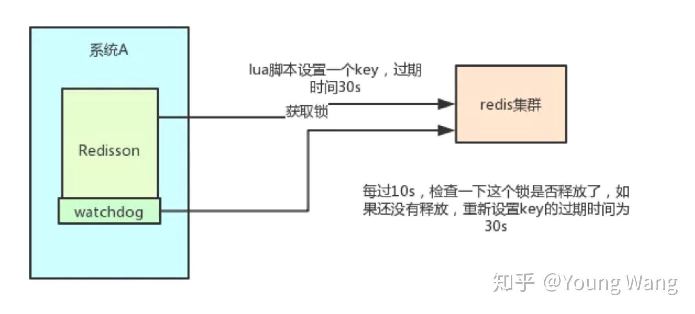

## **为什么需要分布式锁**

在并发场景下，需要使用锁对共享资源互斥访问来保证线程安全；同样，在分布式场景下，也需要一种机制来保证对多节点共享资源的互斥访问，实现机制就是分布式锁。

## **分布式锁特性**

一般来说，分布式锁需要满足以下特性：

1. **（必备）互斥，**即保证不同节点不同线程的互斥访问。
2. **（必备）超时机制**，即超时设置，防止死锁。比如能够支持设置超时时间，防止其他节点一直无法获取到锁；同时需要防止获取锁的任务执行超时导致任务还没结束，锁超时自动释放而无法保证互斥性。
3. **（必备）提供阻塞和非阻塞接口**，例如lock和tryLock。
4. **（可选）可重入性**，同一节点同一条线程如果获取到锁可以再次获取锁。
5. （**可选）公平锁和非公平锁。**

其他要求

1. 高可用
2. 高性能

## 数据库实现

### 第一版本

在数据库中创建一张表，表中包含方法名等字段，并在方法名字段上创建唯一索引，想要执行某个方法，就使用这个方法名向表中插入数据，成功插入则获取锁，执行完成后删除对应的行数据释放锁。

```sql
create table `lock_table` (
    `id` int(11) unsigned NOT NULL auto_increment comment '主键',
    `resource_id` varchar(128) NOT NULL comment '标识资源,可能是某个方法',
    `desc` varchar(128) default NULL comment '描述',
    `ctime` bigint(20) NOT NULL COMMENT '创建时间',
    `utime` bigint(20) NOT NULL COMMENT '更新时间',
    PRIMARY KEY (`id`),
    UNIQUE KEY `unq_resource` (`resource_id`)
) engine=InnoDB default charset=utf8mb4
```

tryLock实现

```sql
insert into lock_table (resource_id, desc) values ('resource_name1', 'desc1')
```

unlock实现

```sql
delete from lock_table where resource_id = 'resource_name1'
```

以上是分布式锁一个简单的实现，它能满足互斥要求，但很明显存在一些问题：

1. 不具备可重入性。
2. 没有锁失效机制，可能导致死锁，如果设置超时，设置成多少合适。
3. 不具备阻塞等待特性；

如果对锁的可重入性、超时时间以及阻塞获取没有这三个需求，还是可以拿来用一用的。

### **改进方案**

- 阻塞获取锁

不获取到锁誓不罢休，一般写一个死循环来执行其操作

```java
@Override
public void lock() {
    while (!lockResource(this.resource)) {
        LockSupport.parkNanos(WAIT_TIME);
    }
}

private boolean lockResource(String resource) {
    // implement lock
    // insert int lock_table (resource_id) values ('ressource');
    return false;
}
```

- 可重入实现

主要是判断表内的clientId 和 当前的client 是否一样，一样就直接返回，并增加重入的次数

```java
@Transcation
private boolean lockResource(String resource) {
    if (lockTable.countByResource(resource) == 0) {
        return lockTable.insert(resource);
    }

    if (Objects.equals(lockTable.getClientId(resource), this.clientId)) {
        return lockTable.increment(resource);
    }

    return false;
}
```

完整实现如下。

```java
public class MySqlDistributedLock implements Lock {
    private static final long WAIT_TIME = 1000 * 1000 * 3;
    private LockTable lockTable;
    /**
     * 标识待锁定资源
     */
    private String resource;

    /**
     * 用于标识客户端，可以是ip+线程id等方式，用于实现可重入特性
     */
    private String clientId;

    public MySqlDistributedLock(LockTable lockTable, String resource) {
        this.lockTable = lockTable;
        this.resource = resource;
    }

    @Override
    @Transcation
    public void lock() {
        while (!lockResource(this.resource))
            LockSupport.parkNanos(WAIT_TIME);
    }

    @Override
    @Transcation
    public boolean tryLock() {
        return lockResource(this.resource);
    }

    @Override
    public boolean tryLock(long expires) {
        long endTime = System.currentTimeMillis() + expires;
        while (!lockResource(this.resource)) {
            if (System.currentTimeMillis() > endTime) {
                return false;
            }
        }
        return true;
    }

    @Override
    @Transcation
    public boolean unLock() {

        int count = lockTable.countForUpdate(this.resource);
        if (count == 0) return false;
        
        if (Objects.equals(lockTable.getClientId(resource), this.clientId)) {
            if (count > 1) return lockTable.decrement(this.resource);
            else return lockTable.delete(this.resource);
        }
        return false;
    }

    private boolean lockResource(String resource) {
        if (lockTable.countForUpdate(resource) == 0) {
            return lockTable.insert(resource);
        }

        if (Objects.equals(lockTable.getClientId(resource), this.clientId)) {
            return lockTable.increment(resource);
        }

        return false;
    }
}
```

此外，还需要一个后台定时任务不断扫描超时的任务。

### 小结

优点：比较简单，也不需要引入额外的中间件例如Redis或ZooKeeper

缺点：实现较为繁琐，需要自己考虑锁超时，可重入等各种情况；性能受局限于数据库性能


## zookeeper实现

### **基本原理**

客户端尝试创建临时znode，创建成功了就获取了这个锁；别的客户端来创建锁会失败，只能注册监听器监听锁。释放锁就是删除这个 znode，一旦释放掉就会通知客户端，然后有一个等待着的客户端就可以再次重新加锁。


### **存在的问题-惊群效应**

当大量客户端去竞争锁的时候，会发生“惊群”效应。这里惊群效应指的是在分布式锁竞争的过程中，大量的"Watcher通知"和“创建/exclusive/lock”两个操作重复运行，并且绝大多数运行结果都创建节点失败，从而继续等待下一次通知。若在集群规模较大的情况下，会对ZooKeeper服务器以及客户端服务器造成巨大的性能影响和网络冲击.

所以基于zk实现，并发量上支持不很高

### **改进方案与实现**

**Curator**是改进方案的实现，其方案如下：

- 使用 ZK 的临时节点和有序节点，每个线程获取锁就是在 ZK 创建一个临时有序的节点，比如在 /lock/ 目录下

- 创建节点成功后，获取 /lock 目录下的所有临时节点，再判断当前线程创建的节点是否是所有的节点的序号最小的节点

- - 如果当前线程创建的节点是所有节点序号最小的节点，则认为获取锁成功
  - 如果当前线程创建的节点不是所有节点序号最小的节点，则对节点序号的前一个节点添加一个事件监听。

比如当前线程获取到的节点序号为 /lock/003，然后所有的节点列表为[/lock/001，/lock/002，/lock/003]，则对 /lock/002 这个节点添加一个事件监听器

Curator的**InterProcessMutex**正是改进方案的实现

同时**InterProcessMutex**还引入了可重入的概念。

注：ZooKeeper 3.4版本集群的问题，父节点不会删除，导致产生大量的父节点。在ZooKeeper 3.5集群以后，引入了一种新的Container节点，如果不存在子节点，则会自动删除。

### 总结：

实现较为简单，可以使用**监听器代替轮询**，性能消耗较小

比较容易产生自增的id

性能和数据库差不多，如果有较多的客户端频繁的申请加锁、释放锁，对于 ZK 集群的压力会比较大。

## redis 实现

### **基本原理**

Redis通过setnx指令来实现分布式锁，这个指令在key不存在时才能设置成功，如果存在，则调用失败，用完后调用del指令进行锁的释放。结合使用expire指令用于设置超时时间，比如5s。

setnx指令是只有当key不存在才能设置成功，5s到时候，setnx又可以成功。

这里有一个问题：setnx和expire这两条指令不是原子的，那么就可能出现setnx执行成功，而正准备执行expire时，突然服务器进程挂掉导致expire无法执行或执行失败，那么就可能导致锁一直被占用。为了解决这个问题，保证setnx和expire两个操作的原子性，需要想办法将setnx和expire捆绑在一起。通过下面这条指令可以做到,还可以lua脚本实现。

```shell
127.0.0.1:6379> set lock:a true ex 5 nx
OK
127.0.0.1:6379> setnx lock:a true
(integer) 0
127.0.0.1:6379> setnx lock:a true
(integer) 1
```

为了避免锁被其他线程释放，释放锁最好带有token释放才比较安全，但是Redis并没有提供根据token删除的指令，为了实现带条件删除锁，我们有必要自己实现一下。下面是通过Lua脚本保证带条件删除的原子性。

```lua
# delifequals
if  redis.call("get", KEYS[1]) == ARGV[1] then
    return redis.call("del", KEYS[1])
else 
    return 0
end
这里说下lua 怎么执行lua脚本
EVAL script numkeys key [key …] arg [arg …]
- script参数是一段 Lua5.1 脚本程序。脚本不必(也不应该[^1])定义为一个 Lua 函数
- numkeys指定后续参数有几个key，即：key [key …]中key的个数。如没有key，则为0
- key [key …] 从 EVAL 的第三个参数开始算起，表示在脚本中所用到的那些 Redis 键(key)。在Lua脚本中通过KEYS[1], KEYS[2]获取。
- arg [arg …] 附加参数。在Lua脚本中通过ARGV[1],ARGV[2]获取。

所以上面的脚本是获取你的锁key 对应的value 是否和你传入的arg 是否一样，一样才认为是你自己的锁，才能删除，value 可以是一个唯一的id。
```

锁的可重入性属性是可选的，咱们来试着基于ThreadLocal + Redis实现一个可重入锁。

```java
public class RedisReentrantLock {
    private ThreadLocal<Map<String, Integer>> lockers = new ThreadLocal<>();
    private Jedis jedis;

    public RedisReentrantLock(Jedis jedis) {
        this.jedis = jedis;
    }

    public boolean lock(String key, int expires) {
        Map<String, Integer> lockCountMap = getLockCountMap();
        Integer count = lockCountMap.get(key);
        if (count != null) {
            lockCountMap.put(key, count + 1);
            return true;
        }
        String res = jedis.set(key, "", SetParams.setParams().nx().ex(expires));
        if (res == null) return false;
        lockCountMap.put(key, 1);
        return true;
    }

    public boolean unLock(String key) {
        Map<String, Integer> lockCountMap = getLockCountMap();
        Integer count = lockCountMap.get(key);
        if (count == null) return false;
        count--;
        if (count > 0) lockCountMap.put(key, count);
        else {
            lockCountMap.remove(key);
            jedis.del(key);
        }
        return true;
    }

    private Map<String, Integer> getLockCountMap() {
        Map<String, Integer> lockCountMap = lockers.get();
        if (lockCountMap != null) return lockCountMap;
        lockers.set(new HashMap<>());
        return lockers.get();
    }
}
```

测试代码如下。

```java
public static void main(String[] args) {
    RedisReentrantLock lock = new RedisReentrantLock(new Jedis("127.0.0.1", 6379));
    final String LOCK_KEY = "lock_a";

    Thread thread1 = new Thread(()->{
        try {
            while (!lock.lock(LOCK_KEY, 5)) {
                System.out.println("thread1:wait lock");
                Thread.sleep(500);
            }
            System.out.println("thread1:get lock");
            Thread.sleep(200);
            lock.unLock(LOCK_KEY);
            System.out.println("thread1:release lock");
        } catch (InterruptedException e) {
        }
    });

    Thread thread2 = new Thread(()->{
        try {
            while (!lock.lock(LOCK_KEY, 5)) {
                System.out.println("thread2:wait lock");
                Thread.sleep(500);
            }
            System.out.println("thread2:get lock");
            Thread.sleep(200);
            lock.unLock(LOCK_KEY);
            System.out.println("thread2:release lock");
        } catch (InterruptedException e) {
        }
    });

    thread1.start();
    thread2.start();

    while (Thread.activeCount() > 0)
        Thread.yield();
}
```

**存在的问题**

- 锁超时后提前释放导致失去互斥性：获取锁的任务由于执行时间过长，超过了expires指定的时间，这时候redis会自动释放锁，其他节点就可能获得该锁，最后违背了互斥性属性。
- 锁在主备不一致导致失去互斥性：在redis主备模式下，当客户端a从主获取到锁后，但在将主复制到slave结点前主挂了，备提升为主，此时锁不存在，客户端b可能会获取锁，

### **改进方案-Redlock算法**

这个锁的算法实现了多redis实例的情况，相对于单redis节点来说，优点在于 防止了 单节点故障造成整个服务停止运行的情况；并且在多节点中锁的设计，及多节点同时崩溃等各种意外情况有自己独特的设计方法；原因看上面的 **存在的问题**

RedLock算法描述

- 部署5个Redis实例。
- 客户端获取当前时间current timestamp，单位是毫秒。
- 客户端用同样的key和value依次尝试在N个实例上建立锁，超时时间要短，如果一个实例上获取不到立即尝试下一个实例。
- 客户端计算获取锁的用时time elapsed，只有当在大多数实例上获取到锁，且获取锁的用时小于锁的有效时间，才认为获取锁成功。
- 如果获取到锁，锁的实际有效时间 = 初始有效时间 – time elapsed
- 如果客户端没有在多数节点上获取锁，或者锁的实际有效时间是负数，则在所有实例上都执行释放锁操作

结论：Redlock解决了大多数投票决定获取锁，但仍然有可能锁超时时获取锁的任务还在执行的情况。

### **优化方案 – Redisson**

实际上基于Redis实现的分布式锁有一个应用较为广泛的开源项目Redisson，有兴趣可以关注一下：[https://github.com/redisson/redisson](https://link.zhihu.com/?target=https%3A//github.com/redisson/redisson)

Redisson是通过不断续租来解决锁超时问题，Redisson 中有一个 Watchdog 的概念，它会在你获取锁之后，每隔 10s 帮你把 Key 的超时时间设为 30s。如此一来就算一直持有锁也不会出现 Key 过期了其他线程获取到锁的问题了（不断续租，不会任务未执行完不会出现租约到期情况）。

Redisson 的“看门狗”逻辑保证了没有死锁发生。(如果机器宕机了，看门狗也就没了。此时就不会延长 Key 的过期时间，到了 30s 之后就会自动过期了，其他线程可以获取到锁)

