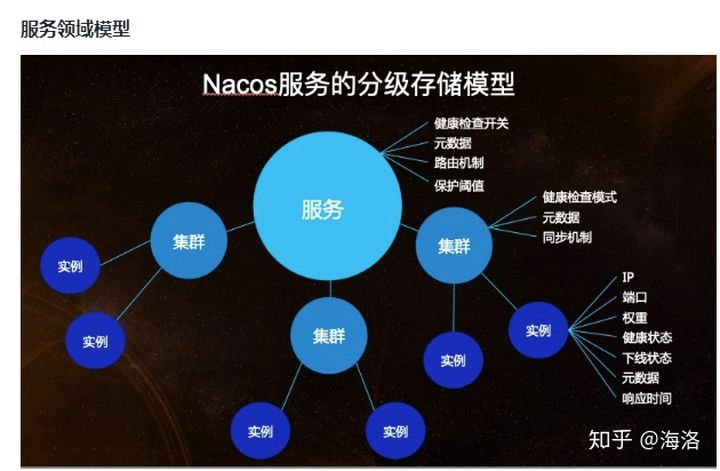
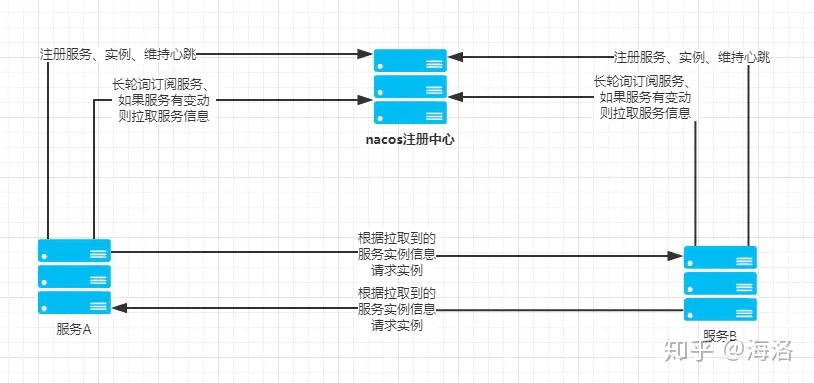

## 单体应用

相对的，要理解什么是微服务，那么可以先理解什么是单体应用，在没有提出微服务的概念的“远古”年代，一个软件应用，往往会将应用所有功能都开发和打包在一起，那时候的一个B/S应用架构往往是这样的：

client----> brower----> server

但是，当用户访问量变大导致一台服务器无法支撑时怎么办呢？加服务器加负载均衡，架构就变成这样了：

上面的架构都还是单体应用，只是在部署方面进行了优化，所以避免不了单体应用的根本的缺点：

- 代码臃肿，应用启动时间长；（代码超过1G的项目都有！）
- 回归测试周期长，修复一个小小bug可能都需要对所有关键业务进行回归测试。
- 应用容错性差，某个小小功能的程序错误可能导致整个系统宕机；
- 伸缩困难，单体应用扩展性能时只能整个应用进行扩展，造成计算资源浪费。
- 开发协作困难，一个大型应用系统，可能几十个甚至上百个开发人员，大家都在维护一套代码的话，代码merge复杂度急剧增加。

## 微服务

任何技术的演进都是有迹可循的，任何新技术的出现都是为了解决原有技术无法解决的需求，所以，微服务的出现就是因为原来单体应用架构已经无法满足当前互联网产品的技术需求。

在微服务架构之前还有一个概念：SOA（Service-Oriented Architecture）-面向服务的体系架构。我认为的SOA只是一个架构模型的方法论，并不是一个明确而严谨的架构标准，只是后面很多人将SOA与The Open Group的SOA参考模型等同了，认为严格按照TOG-SOA标准的才算真正的SOA架构。SOA就已经提出的面向服务的架构思想，所以微服务应该算是SOA的一种演进吧。

撇开架构先不说，什么样的服务才算微服务呢？

- 单一职责的。一个微服务应该都是单一职责的，这才是“微”的体现，一个微服务解决一个业务问题（注意是一个业务问题而不是一个接口）。
- 面向服务的。将自己的业务能力封装并对外提供服务，这是继承SOA的核心思想，一个微服务本身也可能使用到其它微服务的能力。

## 微服务典型架构

### 服务描述

 一般是指这个服务的名称，接口信息等。

采用restful的方式描述服务，可以用swagger2 或者y-api 来展示api信息，供调用方查看和查考，最后进行调用

idl 的方式描述服务，如thrift 、grpc 等

xml 在xml 内定义服务的信息，接口名，参数，返回值等信息，并进行发布和调用

### 注册中心

是指将服务提供者的信息注册到注册中心中，服务消费方会读取注册中心的服务列表，服务消费方链接服务提供者进行服务调用

此外注册中心最好还要有自我保护机制，防止网络抖动的时候，服务提供者和注册中心失去心跳，导致服务提供者被注册中心全部剔除，

进而通知消费者在本地cache list 内删除了服务的所有链接，造成服务的不可调用，自我保护机制就是可以设置当注册中心内某个服务的节点数量超过一个设置的值，或者某个百分比值之后，不会在剔除剩余的节点，防止最后服务的不可调用。

#### 注册信息

服务分组 可以按照业务、机房进行分组

服务名称 可以是spring.application.name

节点信息：ip 、端口、客户端最大连接数 ，版本等信息

#### 注册中心接口

- 服务注册接口： 主要是服务提供者启动的时候 ，会向注册中心注册服务和节点信息
- 服务提反注册接口：服务提供者停止服务的时候，会向注册中心删除注册服务和节点信息
- 服务订阅查询接口：服务消费者，可以查询自己定于的服务列表信息
- 服务查询接口：管理后台可以查询服务列表
- 服务变更接口：服务消费者，订阅了自己的服务，那么服务再变更的时候，会通知消费者服务信息的变化(节点的增减或者其他信息的变更)
- 心跳汇报接口：服务提供者会和注册中心保持信息，也就是续租，来证明自己还up 状态，方式注册长时间没有收到服务提供者的心态，导致删除服务提供者
- 服务修改接口：修改注册中心某一个服务的信息

这里重点要说下服务变更接口

可以有两种实现，一种实现基于推的方式，也就是当服务发生变化后，注册中心会主动推送到订阅方，如 zookeeper

另一种实现，是拉的方式，订阅方会通过定时或者长连接链接拉取的方式 拉取服务列表进行刷新，如eureka

#### 实践

##### zookeeper 实现

首先要保证高可用 ，zookeeper必须要集群部署，利用zookeeper的watcher 机制和临时节点来实现注册中心。

具体节点接口可以按照下面进行组织

/分组名称/服务名称/[ip:port,ip:port,ip:port...]

也就是叶子节点是ip和port的组合，ip:port 节点的值是节点和服务信息的json 值就可以了，ip:port 是个临时节点，服务再down的时候，ip:port 节点就会删除。

那么服务提供者启动的时候，按照这个结构来注册就可以了。

消费者在消费的时候，订阅服务名称这个节点下child 的变化就可以了，增删都可以监听到，这样就可以动态更新本地服务列表了。

zk 是cp 的，是一致性的，但是如果zk 正在选主，或者zk 集群中超过半数不能提供服务，那么这两种情况是不能提供服务，也就是获取不到服务列表的。

​								

##### nacos 实现

1.0.0 版本支持AP和CP 两种协议，可以动态切换。

服务领域模型

Nacos服务领域模型主要分为命名空间、集群、服务。在下图的分级存储模型可以看到，在服务级别，保存了健康检查开关、元数据、路由机制、保护阈值等设置，而集群保存了健康检查模式、元数据、同步机制等数据，实例保存了该实例的ip、端口、权重、健康检查状态、下线状态、元数据、响应时间。

注册中心原理

服务注册方法：服务注册的策略的是每5秒向nacos server发送一次心跳，心跳带上了服务名，服务ip，服务端口等信息。同时 nacos server也会向client 主动发起健康检查，支持tcp/http检查。如果15秒内无心跳且健康检查失败则认为实例不健康，如果30秒内健康检查失败则剔除实例。

##### consul 实现 （CP）

工作原理

服务发现以及注册

当服务 Producer 启动时，会将自己的 Ip/host 等信息通过发送请求告知 Consul，Consul 接收到 Producer 的注册信息后，每隔 10s（默认）会向 Producer 发送一个健康检查的请求，检验 Producer 是否健康。

服务调用

当 Consumer 请求 Product 时，会先从 Consul 中拿到存储 Product 服务的 IP 和 Port 的临时表(temp table)，从temp table 表中任选一个· Producer 的 IP 和 Port， 然后根据这个 IP 和 Port，发送访问请求；temp table 表只包含通过了健康检查的 Producer 信息，并且每隔 10s（默认）更新。

##### eureka 实现

在 Spring Cloud 中，提供了 Eureka 来实现服务发现功能。Eureka 采用的是 Server 和 Client 的模式进行设计，Eureka Server 扮演了服务注册中心的角色，为 Client 提供服务注册和发现的功能。

Eureka Client 通过客户端注册的方式暴露服务，通过注解等方式嵌入到服务提供者的代码中，当服务启动时，服务发现组件会向注册中心注册自身提供的服务，并周期性地发送心跳来更新服务。

如果连续多次心跳不能够发现服务，那么 Eureka Server 就会将这个服务节点从服务注册表中移除，各个服务之间会通过注册中心的注册信息来实现调用。

Eureka 消费者是通过定时拉取服务列表的方式，来实现刷新服务列表的变更的。

Eureka 有自我保护机制，默认开启的。

Eureka 是ap的，也就是说不保证数据的一致性，即使还剩下一台Eureka server，也是能够提供服务，只是服务列表可能不是最新的了。

### 配置中心

#### 为何需要配置中心

随着业务的发展，应用系统中的配置会越来越多，配置之间也有不同的业务特点，比如业务依赖的数据库配置、缓存信息配置、索引存储配置等。这类配置一般比较稳定，不会频繁更改，通常会放在工程中作为配置文件随应用一起发布。

除了这些配置，还有一部分配置会经常发生修改，比如限流降级开关配置、业务中的白名单配置等。这些配置项除了变更频繁，还要求实时性，如果采取和应用一起发布的方式，那么每次变更都要重新发布服务，非常不方便。

为了解决这类配置问题，出现了分布式配置管理平台。

#### 配置管理如何实现

分布式配置管理的本质就是一种推送-订阅模式的运用。配置的应用方是订阅者，配置管理服务则是推送方，客户端发布数据到配置中心，配置中心把配置数据推送到订阅者。

配置管理服务往往会封装一个客户端，应用方则是基于该客户端与配置管理服务进行交互。在实际实现时，客户端可以主动拉取数据，也可以基于事件通知实现。

实现配置管理中心，一般需要下面几个步骤:

1. 提取配置信息，放到一个公共的地方存储，比如文件系统、数据库、Redis；
2. 使用发布/订阅模式，让子系统订阅这些配置信息；
3. 对外开放可视化的配置管理中心，对配置信息进行操作维护

#### 分布式配置管理的特性要求

一个合格的分布式配置管理系统，除了配置发布和推送，还需要满足以下的特性:

1. 高可用性，服务器集群应该无单点故障，只要集群中还有存活的节点，就能提供服务；
2. 容错性，保证在配置平台不可用时，也不影响客户端的正常运行；
3. 高性能，对于配置平台，应该是尽可能低的性能开销，不能因为获取配置给应用带来不可接受的性能损耗；
4. 可靠存储，包括数据的备份容灾，一致性等，尽可能保证不丢失配置数据；
5. 实时生效，对于配置的变更，客户端应用能够及时感知。

#### 实践

##### zookeeper

基于zk 自己研发，主要是借助于zk的watch机制，有变化会推送给client

##### nacos

实现原理

Nacos 并不是通过推的方式将服务端最新的配置信息发送给客户端的，而是客户端维护了一个长轮询的任务，定时去拉取发生变更的配置信息，然后将最新的数据推送给 Listener 的持有者。

检查是否变更，是检查md5

https://zhuanlan.zhihu.com/p/125550699

客户端拉取服务端的数据与服务端推送数据给客户端相比，优势在哪呢，为什么 Nacos 不设计成主动推送数据，而是要客户端去拉取呢？如果用推的方式，服务端需要维持与客户端的长连接，这样的话需要耗费大量的资源，并且还需要考虑连接的有效性，例如需要通过心跳来维持两者之间的连接。而用拉的方式，客户端只需要通过一个无状态的 http 请求即可获取到服务端的数据。

##### consul

##### spring cloud config

基于git 和 svn 实现，可以设置git 的webhook 来实现配置变化的推送给client

##### Apollo 携程

##### disconf

不推荐 不更新了

基于zookeeper 实现

### 监控

服务监控在微服务改造过程中的重要性不言而喻，没有强大的监控能力，改造成微服务架构后，就无法掌控各个不同服务的情况，在遇到调用失败时，如果不能快速发现系统的问题，对于业务来说就是一场灾难。

监控微服务调用前，首先你要搞清楚三个问题：监控的对象是什么？具体监控哪些指标？从哪些维度进行监控？下面就从这三个问题开始，一起来看看如何监控微服务调用。

#### 监控对象

既然要监控，那么要监控哪些对象呢？根据我的实践经验，对于微服务系统来说，监控对象可以分为四个层次，由上到下可归纳为：

##### 用户端监控。

通常是指业务直接对用户提供的功能的监控。以微博首页 Feed 为例，它向用户提供了聚合关注的所有人的微博并按照时间顺序浏览的功能，对首页 Feed 功能的监控就属于用户端的监控。

##### 接口监控。

通常是指业务提供的功能所依赖的具体 RPC 接口的监控。继续以微博首页 Feed 为例，这个功能依赖于用户关注了哪些人的关系服务，每个人发过哪些微博的微博列表服务，以及每条微博具体内容是什么的内容服务，对这几个服务的调用情况的监控就属于接口监控。

##### Sql 监控

##### 资源监控

通常是指某个接口依赖的资源的监控。比如用户关注了哪些人的关系服务使用的是 Redis 来存储关注列表，对 Redis 的监控就属于资源监控。

##### 基础监控。

通常是指对服务器本身的健康状况的监控。主要包括 CPU 利用率、内存使用量、I/O 读写量、网卡带宽等。对服务器的基本监控也是必不可少的，因为服务器本身的健康状况也是影响服务本身的一个重要因素，比如服务器本身连接的网络交换机上联带宽被打满，会影响所有部署在这台服务器上的业务。

#### 监控指标

搞清楚要监控的对象之后，需要监控具体哪些指标呢？通常有以下几个业务指标需要重点监控：

##### 请求量。

请求量监控分为两个维度，一个是实时请求量，一个是统计请求量。实时请求量用 QPS（Queries Per Second）即每秒查询次数来衡量，它反映了服务调用的实时变化情况。统计请求量一般用 PV（Page View）即一段时间内用户的访问量来衡量，比如一天的 PV 代表了服务一天的请求量，通常用来统计报表。

##### 响应时间。

大多数情况下，可以用一段时间内所有调用的平均耗时来反映请求的响应时间。但它只代表了请求的平均快慢情况，有时候我们更关心慢请求的数量。为此需要把响应时间划分为多个区间，比如 0～10ms、10ms～50ms、50ms～100ms、100ms～500ms、500ms 以上这五个区间，其中 500ms 以上这个区间内的请求数就代表了慢请求量，正常情况下，这个区间内的请求数应该接近于 0；在出现问题时，这个区间内的请求数会大幅增加，可能平均耗时并不能反映出这一变化。除此之外，还可以从 P90、P95、P99、P999 角度来监控请求的响应时间，比如 P99 = 500ms，意思是 99% 的请求响应时间在 500ms 以内，它代表了请求的服务质量，即 SLA。

###### TPtime

###### 最大响应时间

###### 最小响应时间

###### 平均响应时间

##### 成功数

##### 失败数

##### QPS

##### 错误率。

错误率的监控通常用一段时间内调用失败的次数占调用总次数的比率来衡量，比如对于接口的错误率一般用接口返回错误码为 503 的比率来表示。

#### 监控维度

一般来说，要从多个维度来对业务进行监控，具体来讲可以包括下面几个维度：

##### 全局维度。

从整体角度监控对象的的请求量、平均耗时以及错误率，全局维度的监控一般是为了让你对监控对象的调用情况有个整体了解。

##### 分机房维度。

一般为了业务的高可用性，服务通常部署在不止一个机房，因为不同机房地域的不同，同一个监控对象的各种指标可能会相差很大，所以需要深入到机房内部去了解。

##### 单机维度。

即便是在同一个机房内部，可能由于采购年份和批次的不同，位于不同机器上的同一个监控对象的各种指标也会有很大差异。一般来说，新采购的机器通常由于成本更低，配置也更高，在同等请求量的情况下，可能表现出较大的性能差异，因此也需要从单机维度去监控同一个对象。

##### 时间维度。

同一个监控对象，在每天的同一时刻各种指标通常也不会一样，这种差异要么是由业务变更导致，要么是运营活动导致。为了了解监控对象各种指标的变化，通常需要与一天前、一周前、一个月前，甚至三个月前做比较。

##### 核心维度。

根据我的经验，业务上一般会依据重要性程度对监控对象进行分级，最简单的是分成核心业务和非核心业务。核心业务和非核心业务在部署上必须隔离，分开监控，这样才能对核心业务做重点保障。

#### 展示

cat 本身提供展示

granfan 展示

#### 告警

cat 本身带告警模块，可以配置相应的告警规则配置，支持告警接口配置，但是发送短信、邮件、微信的报警的http服务需要自己开发

prometheus  Alertmanager  组件可以配置告警规则

#### 实践

美团点评 CAT 监控接口等指标

prometheus 监控资源、基础指标

open-falcon

### 服务追踪

#### Dapper 论文

http://bigbully.github.io/Dapper-translation/

#### 介绍原理

https://www.jianshu.com/p/bda482c9f14f

#### 框架

### 服务治理

在进行微服务调用的过程中，可能会出现的情况，比如：

- 注册中心宕机；
- 服务提供者B有节点宕机；
- 服务消费者A和注册中心之间的网络不通；
- 服务提供者B和注册中心之间的网络不通；
- 服务消费者A和服务提供者B之间的网络不通；
- 服务提供者B有些节点性能变慢；
- 服务提供者B短时间内出现问题。

可见，一次服务调用，服务提供者、注册中心、网络这三者都可能会有问题，此时服务消费者应该如何处理才能确保调用成功呢？这就是服务治理要解决的问题。

具体手段包含：节点管理、负载均衡、服务路由、服务容错

#### 节点管理

服务调用失败一般是由两类原因引起的，一类是服务提供者自身出现问题，如服务器宕机、进程意外退出等；一类是网络问题，如服务提供者、注册中心、服务消费者这三者任意两者之间的网络出现问题。

无论是服务提供者自身出现问题还是网络发生问题，都有两种节点管理手段。

**1. 注册中心主动摘除机制**

这种机制要求服务提供者定时的主动向注册中心汇报心跳，注册中心根据服务提供者节点最近一次汇报心跳的时间与上一次汇报心跳时间做比较，如果超出一定时间，就认为服务提供者出现问题，继而把节点从服务列表中摘除，并把最近的可用服务节点列表推送给服务消费者。

**2. 服务消费者摘除机制**

虽然注册中心主动摘除机制可以解决服务提供者节点异常的问题，但如果是因为注册中心与服务提供者之间的网络出现异常，最坏的情况是注册中心会把服务节点全部摘除，导致服务消费者没有可用的服务节点调用，但其实这时候服务提供者本身是正常的。所以，将存活探测机制用在服务消费者这一端更合理，如果服务消费者调用服务提供者节点失败，就将这个节点从内存中保存的可用服务提供者节点列表中移除。

#### 负载均衡

一般情况下，服务提供者节点不是唯一的，多是以集群的方式存在，尤其是对于大规模的服务调用来说，服务提供者节点数目可能有上百上千个。由于机器采购批次的不同，不同服务节点本身的配置也可能存在很大差异，新采购的机器CPU和内存配置可能要高一些，同等请求量情况下，性能要好于旧的机器。对于服务消费者而言，在从服务列表中选取可用节点时，如果能让配置较高的新机器多承担一些流量的话，就能充分利用新机器的性能。这就需要对负载均衡算法做一些调整。

常用的负载均衡算法主要包括以下几种。

**1. 随机算法**

顾名思义就是从可用的服务节点中随机选取一个节点。一般情况下，随机算法是均匀的，也就是说后端服务节点无论配置好坏，最终得到的调用量都差不多。

**2. 轮询算法**

就是按照固定的权重，对可用服务节点进行轮询。如果所有服务节点的权重都是相同的，则每个节点的调用量也是差不多的。但可以给某些硬件配置较好的节点的权重调大些，这样的话就会得到更大的调用量，从而充分发挥其性能优势，提高整体调用的平均性能。

**3. 最少活跃调用算法**

这种算法是在服务消费者这一端的内存里动态维护着同每一个服务节点之间的连接数，当调用某个服务节点时，就给与这个服务节点之间的连接数加1，调用返回后，就给连接数减1。然后每次在选择服务节点时，根据内存里维护的连接数倒序排列，选择连接数最小的节点发起调用，也就是选择了调用量最小的服务节点，性能理论上也是最优的。

**4. 一致性Hash算法**

指相同参数的请求总是发到同一服务节点。当某一个服务节点出现故障时，原本发往该节点的请求，基于虚拟节点机制，平摊到其他节点上，不会引起剧烈变动。

这几种算法的实现难度也是逐步提升的，所以选择哪种节点选取的负载均衡算法要根据实际场景而定。如果后端服务节点的配置没有差异，同等调用量下性能也没有差异的话，选择随机或者轮询算法比较合适；如果后端服务节点存在比较明显的配置和性能差异，选择最少活跃调用算法比较合适。

#### 服务路由

有些像AB test

对于服务消费者而言，在内存中的可用服务节点列表中选择哪个节点不仅由负载均衡算法决定，还由路由规则确定。

所谓的路由规则，就是通过一定的规则如条件表达式或者正则表达式来限定服务节点的选择范围。

为什么要制定路由规则呢？主要有两个原因。

**1. 业务存在灰度发布的需求**

比如，服务提供者做了功能变更，但希望先只让部分人群使用，然后根据这部分人群的使用反馈，再来决定是否做全量发布。这个时候，就可以通过类似按尾号进行灰度的规则限定只有一定比例的人群才会访问新发布的服务节点。

**2. 多机房就近访问的需求**

据我所知，大部分业务规模中等及以上的互联网公司，为了业务的高可用性，都会将自己的业务部署在不止一个IDC中。这个时候就存在一个问题，不同IDC之间的访问由于要跨IDC，通过专线访问，尤其是IDC相距比较远时延迟就会比较大，比如北京和广州的专线延迟一般在30ms左右，这对于某些延时敏感性的业务是不可接受的，所以就要一次服务调用尽量选择同一个IDC内部的节点，从而减少网络耗时开销，提高性能。这时一般可以通过IP段规则来控制访问，在选择服务节点时，优先选择同一IP段的节点。

那么路由规则该如何配置呢？根据我的实际项目经验，一般有两种配置方式。

**1. 静态配置**

就是在服务消费者本地存放服务调用的路由规则，在服务调用期间，路由规则不会发生改变，要想改变就需要修改服务消费者本地配置，上线后才能生效。

**2. 动态配置**

这种方式下，路由规则是存在注册中心的，服务消费者定期去请求注册中心来保持同步，要想改变服务消费者的路由配置，可以通过修改注册中心的配置，服务消费者在下一个同步周期之后，就会请求注册中心来更新配置，从而实现动态更新。

#### 服务容错

服务调用并不总是一定成功的，前面我讲过，可能因为服务提供者节点自身宕机、进程异常退出或者服务消费者与提供者之间的网络出现故障等原因。对于服务调用失败的情况，需要有手段自动恢复，来保证调用成功。

常用的手段主要有以下几种。

- FailOver：失败自动切换。就是服务消费者发现调用失败或者超时后，自动从可用的服务节点列表总选择下一个节点重新发起调用，也可以设置重试的次数。这种策略要求服务调用的操作必须是幂等的，也就是说无论调用多少次，只要是同一个调用，返回的结果都是相同的，一般适合服务调用是读请求的场景。
- FailBack：失败通知。就是服务消费者调用失败或者超时后，不再重试，而是根据失败的详细信息，来决定后续的执行策略。比如对于非幂等的调用场景，如果调用失败后，不能简单地重试，而是应该查询服务端的状态，看调用到底是否实际生效，如果已经生效了就不能再重试了；如果没有生效可以再发起一次调用。
- FailCache：失败缓存。就是服务消费者调用失败或者超时后，不立即发起重试，而是隔一段时间后再次尝试发起调用。比如后端服务可能一段时间内都有问题，如果立即发起重试，可能会加剧问题，反而不利于后端服务的恢复。如果隔一段时间待后端节点恢复后，再次发起调用效果会更好。
- FailFast：快速失败。就是服务消费者调用一次失败后，不再重试。实际在业务执行时，一般非核心业务的调用，会采用快速失败策略，调用失败后一般就记录下失败日志就返回了。

从我对服务容错不同策略的描述中，你可以看出它们的使用场景是不同的，一般情况下对于幂等的调用，可以选择FailOver或者FailCache，非幂等的调用可以选择FailBack或者FailFast。

限流

降级

熔断

超时

重试

失效转移

自我保护

### API网关

##### 网关的好处

- 聚合接口使得服务对调用者透明，客户端与后端的耦合度降低
- 聚合后台服务，节省流量，提高性能，提升用户体验
- 提供安全、鉴权、流控、熔断、降级、过滤、缓存、计费、监控等 API 管理功能
- 统一接口域名管理
- 路由、灰度发布、ab test、健康检查、自我保护制

##### 网关分类

###### **外部网站**

是指开放给客户的api ，或者是开放平台网关

###### **内部内网关**

是公司内网系统间调用，这个一般采用注册中心来代替，有client 才处理负载，容错等处理

###### **内部外网网关**

是指公司的H5、网页、app 调用的接口网关

###### 实践

spring cloud gateway

zuul

orange 基于openresty 实现

kong 基于openresty 实现

基于openresty 开发

基于openresty 拉取注册中心Eureka  demo 查看   https://github.com/zhaojun2066/lua-resty-gateway-eureka

## RPC 实现原理

反射+代理+socket+http

## 统一日志

ELK