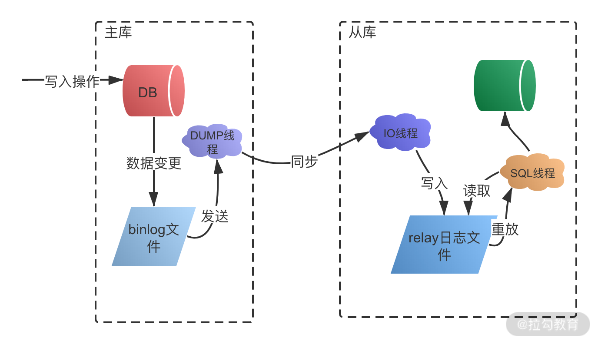

## 读写分离

### 为什么要读写分离

大多数互联网业务，往往读多写少，这时候，数据库的读会首先称为数据库的瓶颈，这时，如果我们希望能够线性的提升数据库的读性能，**消除读写锁冲突从而提升数据库的写性能**，用一句话概括，读写分离是用来**解决数据库的读性能瓶颈的**

### 架构模型

#### client 方式


客户端（client）主动做负载均衡，这种模式下一般会把数据库的连接信息放在客户端的连接层。也就是说，由客户端来选择后端数据库进行查询。

客户端直连方案，因为少了一层 proxy 转发，所以查询性能稍微好一点儿，并且整体架构简单，排查问题更方便。但是这种方案，由于要了解后端部署细节，所以在出现主备切换、库迁移等操作的时候，客户端都会感知到，并且需要调整数据库连接信息。你可能会觉得这样客户端也太麻烦了，信息大量冗余，架构很丑。其实也未必，一般采用这样的架构，一定会伴随一个负责管理后端的组件，比如 Zookeeper，尽量让业务端只专注于业务逻辑开发。

#### proxy方式


在 MySQL 和客户端之间有一个中间代理层 proxy，客户端只连接 proxy， 由 proxy 根据请求类型和上下文决定请求的分发路由。

带 proxy 的架构，对客户端比较友好。客户端不需要关注后端细节，连接维护、后端信息维护等工作，都是由 proxy 完成的。但这样的话，对后端维护团队的要求会更高。而且，proxy 也需要有高可用架构。因此，带 proxy 架构的整体就相对比较复杂。


### MYSQL 主从复制

读写分离是基于主从复制架构实现的

MySQL InnoDB 引擎的主从复制，是通过二进制日志 binlog 来实现。除了数据查询语句 select 以外，binlog 日志记录了其他各类数据写入操作，包括 DDL 和 DML 语句。

binlog 有三种格式：Statement、Row 及 Mixed。

**Statement 格式**，基于 SQL 语句的复制
在 Statement 格式中，binlog 会记录每一条修改数据的 SQL 操作，从库拿到后在本地进行回放就可以了。

**Row 格式**，基于行信息复制
Row 格式以行为维度，记录每一行数据修改的细节，不记录执行 SQL 语句的上下文相关的信息，仅记录行数据的修改。假设有一个批量更新操作，会以行记录的形式来保存二进制文件，这样可能会产生大量的日志内容。

**Mixed 格式**，混合模式复制
Mixed 格式，就是 Statement 与 Row 的结合，在这种方式下，不同的 SQL 操作会区别对待。比如一般的数据操作使用 row 格式保存，有些表结构的变更语句，使用 statement 来记录。

**主从复制过程如图**



### 延时问题 mysql

延迟就会造成主从的数据在短时内的数据不一致，导致数据的过期读。

#### 延迟的原因

1. 备库所在机器的性能要比主库所在的机器性能差

2.  备库的压力大，一般的想法是，主库既然提供了写能力，那么备库可以提供一些读能力。或者一些运营后台需要的分析语句，不能影响正常业务，所以只能在备库上跑。

3. 大事务，因为主库上必须等事务执行完成才会写入 binlog，再传给备库。所以，如果一个主库上的语句执行 10 分钟，那这个事务很可能就会导致从库延迟 10 分钟。不知道你所在公司的 DBA 有没有跟你这么说过：不要一次性地用 delete 语句删除太多数据。其实，这就是一个典型的大事务场景。

比如，一些归档类的数据，平时没有注意删除历史数据，等到空间快满了，业务开发人员要一次性地删掉大量历史数据。同时，又因为要避免在高峰期操作会影响业务（至少有这个意识还是很不错的），所以会在晚上执行这些大量数据的删除操作。

4. 另一种典型的大事务场景，就是大表 DDL。

5. 并行策略？？？？

#### 解决方案

##### 强制走主库方案

- 对于必须要拿到最新结果的请求，强制将其发到主库上，例如对于交易等敏感的信息。
- 对于可以读到旧数据的请求，才将其发到从库上。例如 评论、点赞等信息。

当然，这个方案最大的问题在于，有时候你会碰到“所有查询都不能是过期读”的需求，比如一些金融类的业务。这样的话，你就要放弃读写分离，所有读写压力都在主库，等同于放弃了扩展性。

##### sleep 方案

可以让页面添加完数据库后，sleep 一会再去查询数据，比如主备延迟1s ，可以延迟1s 再去查询，或者页面直接显示刚刚保存的数据在列表内，不是真正的去后台查询，过一段时间再去查询。

也就是说，这个 sleep 方案确实解决了类似场景下的过期读问题。但，从严格意义上来说，这个方案存在的问题就是不精确。

这个不精确包含了两层意思：如果这个查询请求本来 0.5 秒就可以在从库上拿到正确结果，也会等 1 秒；如果延迟超过 1 秒，还是会出现过期读。

##### 判断主备无延迟方案

###### seconds_behind_master 

通过show slave status 查看结果内的seconds_behind_master 的值，可以用来衡量主备延迟时间的长短

如果这个值等于0，说明无延迟，但是是秒，可以在每次执行从库查询的时候，现在执行这个语句来判断这个值是否为0，如果为 0 才说明同步完成进行查询操作

###### 对比位点确保主备无延迟

通过show slave status ，部分结果如下：


- Master_Log_File 和 Read_Master_Log_Pos，表示的是读到的主库的最新位点；
- Relay_Master_Log_File 和 Exec_Master_Log_Pos，表示的是备库执行的最新位点。

如果 Master_Log_File 和 Relay_Master_Log_File、Read_Master_Log_Pos 和 Exec_Master_Log_Pos 这两组值完全相同，就表示接收到的日志已经同步完成。

###### 对比 GTID 集合确保主备无延迟

- Auto_Position=1 ，表示这对主备关系使用了 GTID 协议。
- Retrieved_Gtid_Set，是备库收到的所有日志的 GTID 集合；
- Executed_Gtid_Set，是备库所有已经执行完成的 GTID 集合。

如果这两个集合相同，也表示备库接收到的日志都已经同步完成。

##### semi-sync 方案

我们上面判断主备无延迟的逻辑，是“备库收到的日志都执行完成了”。但是，从 binlog 在主备之间状态的分析中，不难看出还有一部分日志，处于客户端已经收到提交确认，而备库还没收到日志的状态。如图：


这时，主库上执行完成了三个事务 trx1、trx2 和 trx3，其中：trx1 和 trx2 已经传到从库，并且已经执行完成了；trx3 在主库执行完成，并且已经回复给客户端，但是还没有传到从库中。如果这时候你在从库 B 上执行查询请求，按照我们上面的逻辑，从库认为已经没有同步延迟，但还是查不到 trx3 的。严格地说，就是出现了过期读。

要解决这个问题，就要引入半同步复制，也就是 **semi-sync replication**。

**semi-sync 做了这样的设计：**

- 事务提交的时候，主库把 binlog 发给从库；
- 从库收到 binlog 以后，发回给主库一个 ack，表示收到了；
- 主库收到这个 ack 以后，才能给客户端返回“事务完成”的确认。

这样，semi-sync 配合前面关于位点的判断，就能够确定在从库上执行的查询请求，可以避免过期读。

但是，semi-sync+ 位点判断的方案，只对一主一备的场景是成立的。在一主多从场景中，主库只要等到一个从库的 ack，就开始给客户端返回确认。这时，在从库上执行查询请求，就有两种情况：

- 如果查询是落在这个响应了 ack 的从库上，是能够确保读到最新数据；
- 但如果是查询落到其他从库上，它们可能还没有收到最新的日志，就会产生过期读的问题。

**semi-sync 配合判断主备无延迟的方案，存在两个问题：**

- 一主多从的时候，在某些从库执行查询请求会存在过期读的现象；
- 在持续延迟的情况下，可能出现过度等待的问题。

##### 等主库位点方案

先介绍一条命令

```shel
select master_pos_wait(file, pos[, timeout]);
```

这条命令的逻辑如下：

它是在从库执行的；

- 参数 file 和 pos 指的是主库上的文件名和位置；
- timeout 可选，设置为正整数 N 表示这个函数最多等待 N 秒。
- 这个命令正常返回的结果是一个正整数 M，表示从命令开始执行，到应用完 file 和 pos 表示的 binlog 位置，执行了多少事务。

当然，除了正常返回一个正整数 M 外，这条命令还会返回一些其他结果，包括：

- 如果执行期间，备库同步线程发生异常，则返回 NULL；
- 如果等待超过 N 秒，就返回 -1；
- 如果刚开始执行的时候，就发现已经执行过这个位置了，则返回 0。

执行顺序：

- 在执行完一条事物后，马上执行 show master status 得到当前主库执行到的 File 和 Position；
- 选定一个从库执行查询语句；
- 在从库上执行 select master_pos_wait(File, Position, 1)；
- 如果返回值是 >=0 的正整数，则在这个从库执行查询语句；
- 否则，到主库执行查询语句。

按照我们设定不允许过期读的要求，就只有两种选择，一种是超时放弃，一种是转到主库查询。

##### 等 GTID 方案

如果你的数据库开启了 GTID 模式，对应的也有等待 GTID 的方案。

```she
select wait_for_executed_gtid_set(gtid_set, 1);
```

这条命令的逻辑是：

- 等待，直到这个库执行的事务中包含传入的 gtid_set，返回 0；
- 超时返回 1

执行顺序：

- 事务更新完成后，从返回包直接获取这个事务的 GTID，记为 gtid1；
- 选定一个从库执行查询语句；
- 在从库上执行 select wait_for_executed_gtid_set(gtid1, 1)；
- 如果返回值是 0，则在这个从库执行查询语句；
- 否则，到主库执行查询语句。

按照我们设定不允许过期读的要求，就只有两种选择，一种是超时放弃，一种是转到主库查询。

转到主库查询，需要做好相应的限流策略。

##### 放缓存方案

可以最近20分钟的数据放入cache，查询的时候，合并从库和cache内的数据进行展示，一般cache的失效时间要大于主从同步延迟的时间，合并的时候，要注意去重数据问题。