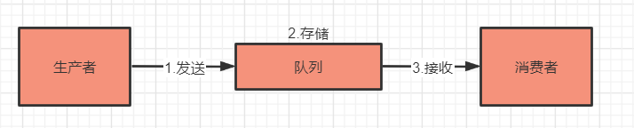
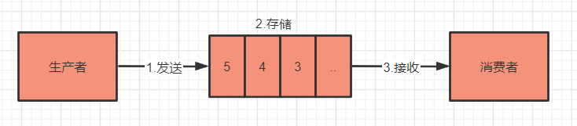
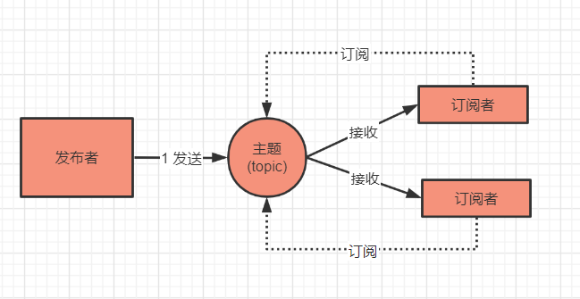
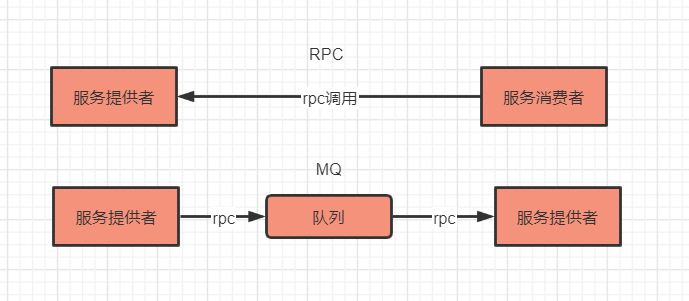
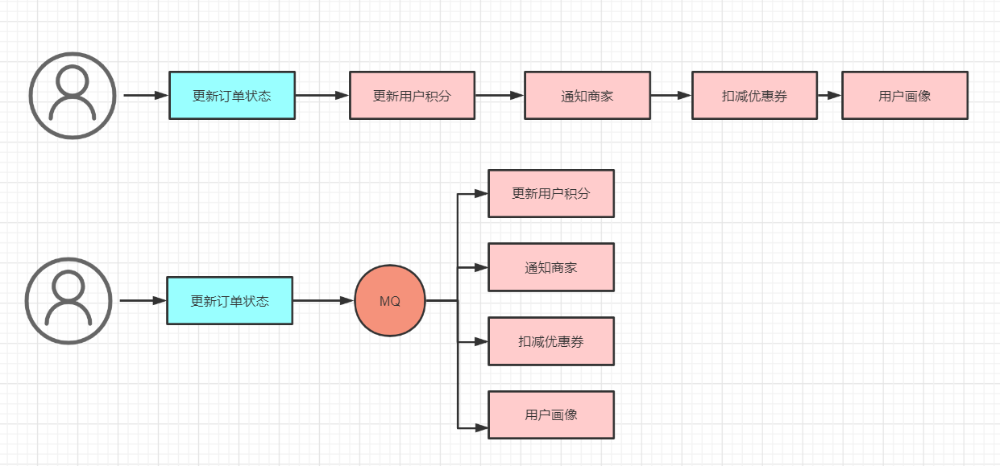
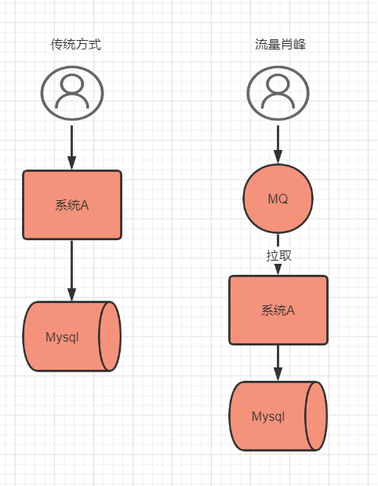
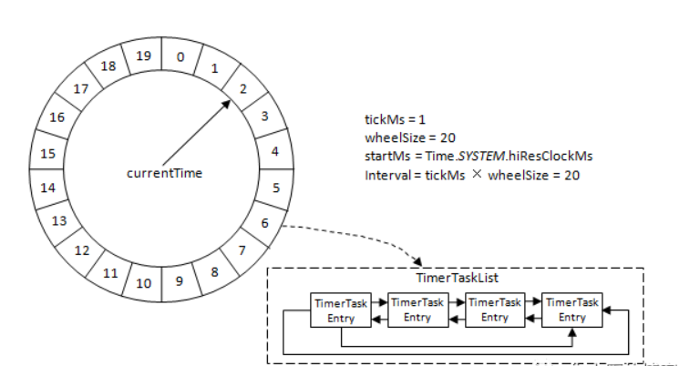
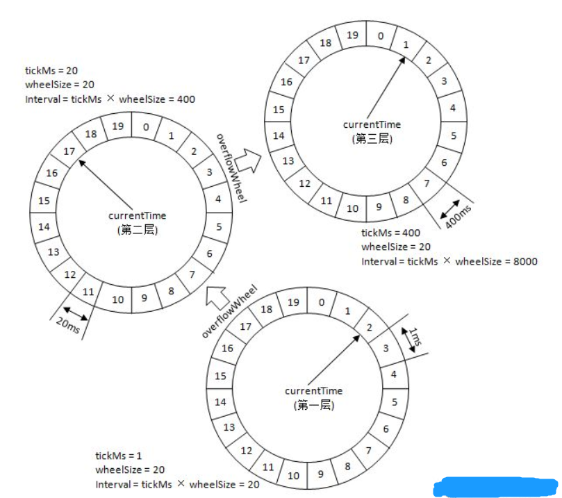

# 什么是MQ

## 从 MQ 的本质说起

将 MQ 掰开了揉碎了来看，都是「一发一存一消费」，再直白点就是一个「转发器」。

生产者先将消息投递一个叫做「队列」的容器中，然后再从这个容器中取出消息，最后再转发给消费者，仅此而已。

1、消息：就是要传输的数据，可以是最简单的文本字符串，也可以是自定义的复杂格式（只要能按预定格式解析出来即可）。
 2、队列：大家应该再熟悉不过了，是一种先进先出数据结构。它是存放消息的容器，消息从队尾入队，从队头出队，入队即发消息的过程，出队即收消息的过程。

## MQ的进化

常用的消息队列产品（RocketMQ、Kafka 等等），你会发现：它们都在最原始的消息模型上做了扩展，同时提出了一些新名词，比如：主题（topic）、分区（partition）、队列（queue）等等。

要彻底理解这些五花八门的新概念，我们化繁为简，先从消息模型的演进说起（**道理好比：架构从来不是设计出来的，而是演进而来的**）

### **队列模型**

消息按照什么顺序写进去，就按照什么顺序读出来。不过，队列没有 “读” 这个操作，读就是出队，从队头中 “删除” 这个消息。

这便是队列模型：它允许多个生产者往同一个队列发送消息。但是，如果有多个消费者，实际上是竞争的关系，也就是一条消息只能被其中一个消费者接收到，读完即被删除。

### **发布-订阅模型**

如果需要将一份消息数据分发给多个消费者，并且每个消费者都要求收到全量的消息。很显然，队列模型无法满足这个需求。

一个可行的方案是：为每个消费者创建一个单独的队列，让生产者发送多份。这种做法比较笨，而且同一份数据会被复制多份，也很浪费空间。

为了解决这个问题，就演化出了另外一种消息模型：发布-订阅模型。

在发布-订阅模型中，存放消息的容器变成了 “主题”，订阅者在接收消息之前需要先 “订阅主题”。最终，每个订阅者都可以收到同一个主题的全量消息。

仔细对比下它和 “队列模式” 的异同：生产者就是发布者，队列就是主题，消费者就是订阅者，无本质区别。唯一的不同点在于：一份消息数据是否可以被多次消费。

### 总结

上面两种模型说白了就是：单播和广播的区别。而且，当发布-订阅模型中只有 1 个订阅者时，它和队列模型就一样了，因此在功能上是完全兼容队列模型的。

包括大家接触到的 “消费组”、“集群消费”、“广播消费” 这些概念，都和上面这两种模型相关，以及在应用层面大家最常见的情形：组间广播、组内单播，也属于此范畴。

## MQ的应用场景

### 场景

熟悉有 ：系统解耦、异步通信、流量削峰、延迟通知(rocketmq)、最终一致性、顺序消息、流式处理(kafka)

### mq 和 rpc 通信的区别

通过对比，能很明显地看出两点差异：

- 引入 MQ 后，由之前的一次 RPC 变成了现在的两次 RPC，而且生产者只跟队列耦合，它根本无需知道消费者的存在。
- 多了一个中间节点「队列」进行消息转储，相当于将同步变成了异步。

举一个实际例子，比如说电商业务中最常见的「订单支付」场景：在订单支付成功后，需要更新订单状态、更新用户积分、通知商家有新订单、更新推荐系统中的用户画像等等。

引入 MQ 后，订单支付现在只需要关注它最重要的流程：更新订单状态即可。其他不重要的事情全部交给 MQ 来通知。这便是 MQ 解决的最核心的问题：**系统解耦。**

改造前订单系统依赖 3 个外部系统，改造后仅仅依赖 MQ，而且后续业务再扩展（比如：营销系统打算针对支付用户奖励优惠券），也不涉及订单系统的修改，从而保证了核心流程的稳定性，**降低了维护成本**。

这个改造还带来了另外一个好处：因为 MQ 的引入，更新用户积分、通知商家、更新用户画像这些步骤全部变成了异步执行，能减少订单支付的整体耗时，提升订单系统的吞吐量。这便是 MQ 的另一个典型应用场景：**异步通信**。

### 流量削峰

如秒杀、发布微博、点赞等，主要在流量很大的情况下，用于保护后端服务的处理能力。

主要通过mq 将流程异步化，将请求存入mq，有后端服务拉取mq消息（批量），按照后端的处理能力来拉取消息进行相应的处理，之后再通知用户。

发布微博的话，需要将内容存入redis，然后再写入mq，后台服务再根据自身处理能力来拉取数据进行相应的处理和存储。

简单的对比图如下

具体写入mq，可以再openresty这层去处理，直接发送到mq就可以了

### 延迟通知或者延迟队列

简单举个例子，订单会有很多状态，已收货，系统自动评价等，考虑这个一个场景，客户收到货后，如果10个小时内没有做出评价，需要系统自动给未评价的订单做出自动评价，这是个明显的延迟消息来处理的业务。【其他订单30分钟内没有支付，取消订单】

那么我就可以将待评价的订单放入延迟队列内，等到10个小时会自动被消费者消费，消费者可以判断是否进行了评价，没有评价则进行系统评价

> 具体实现方案

- 定时轮训 好low啊
- 环形队列

原理图：

时间轮（TimeWheel）就是一个存储了定时任务的环形队列，底层可以采用数组实现或者双向链表实现，内部的每个元素存储的是一个定时任务列表，一般是一个双向链接或者集合都可以，链表内的每一项都是一个定时任务。

时间轮有多个时间格组成，每个时间格代表当前时间时间轮的基本时间跨度(tickMs), 时间轮的时间格的个数是固定的，可用wheelSize表示，那么真个时间轮的总体时间跨度( interval ) 可以通过公式 tickMs * wheelSize 计算得出。时间轮还有一个表盘指针(currentTime) ，用来表示时间轮当前所处的时间，currentTime 是tickTime的整数倍。currentTime 可以将整个时间轮划分为到期部分和非到期部分，currentTime 当前指定的时间格属于到期部分，表示刚好到期，需要处理此时间格所对应的所有的定时任务链表或者集合。

比如时间轮的tickMs = 1ms ,wheelSize = 20 没那么计算可以得到总的时间跨度 interval = 20ms。初始情况下表盘指针currentTime 指定时间格为0，此时有一个定时在2ms需要执行的任务插入进来，应该放到时间格为2的位置，随着时间的推移，指针currentTime不断地向前推进，过了2ms 后，当到达时间格2时候，需要将时间格2内的所有任务进行执行和到期操作，此时如果又有一个8ms的任务插入进来，则会放入到时间格10内，currentTime 经过8ms 后会指向时间格10的位置。如果同时有一个定时为19ms 的任务插入进来怎么办？（2+19 = 21,21%20=1）,如果插入的定时任务，超过了总的时间跨度，那么就不能在用这个时间轮了。此时有了层级时间轮的概念，当任务超过了当前时间轮所表示的时间范围时，就会尝试添加到上层的时间轮中。

比如当一个为350ms的定时任务，明显超过了20ms 的时间轮。

参考上图，第一层的时间轮tickMs=1ms, wheelSize=20, interval=20ms。第二层的时间轮的tickMs为第一层时间轮的interval，即为20ms。每一层时间轮的wheelSize是固定的，都是20，那么第二层的时间轮的总体时间跨度interval为400ms。以此类推，这个400ms也是第三层的tickMs的大小，第三层的时间轮的总体时间跨度为8000ms。

对于之前所说的350ms的定时任务，显然第一层时间轮不能满足条件，所以就升级到第二层时间轮中，最终被插入到第二层时间轮中时间格17所对应的TimerTaskList中。如果此时又有一个定时为450ms的任务，那么显然第二层时间轮也无法满足条件，所以又升级到第三层时间轮中，最终被插入到第三层时间轮中时间格1的TimerTaskList中。注意到在到期时间在[400ms,800ms)区间的多个任务（比如446ms、455ms以及473ms的定时任务）都会被放入到第三层时间轮的时间格1中，时间格1对应的TimerTaskList的超时时间为400ms。随着时间的流逝，当次TimerTaskList到期之时，原本定时为450ms的任务还剩下50ms的时间，还不能执行这个任务的到期操作。这里就有一个时间轮降级的操作，会将这个剩余时间为50ms的定时任务重新提交到层级时间轮中，此时第一层时间轮的总体时间跨度不够，而第二层足够，所以该任务被放到第二层时间轮到期时间为[40ms,60ms)的时间格中。再经历了40ms之后，此时这个任务又被“察觉”到，不过还剩余10ms，还是不能立即执行到期操作。所以还要再有一次时间轮的降级，此任务被添加到第一层时间轮到期时间为[10ms,11ms)的时间格中，之后再经历10ms后，此任务真正到期，最终执行相应的到期操作

- JDK DelayQueue
- Redis key 过期事件回调通知
- RocketMq
- RabbitMq
- Kafka

基于时间轮也就是环形队列实现

