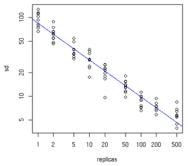

## 到底什么是分布式缓存

分布式缓存，现在是提高系统并发数、吞吐量、响应时间，降低后台系统负载压力或者数据库读取压力的重要手段。如果采用单机来存储缓存的数据，那么随着数据量的增加，单机环境肯定就力不从心了，这时候就需要一个分布式的系统来缓存这些数据，将数据缓存的数据分发到分布式系统的各个节点，来提供分布式的处理能力。

缓存技术是无处不在，有我们大家都熟悉的后端缓存： redis 、memcache、本地cache等。还有客户端缓存：页面缓存、aap端缓存。还有cdn 、代理缓存等，从代理到后端，还会有多级缓存架构的设计。

这里我们重点说下后端分布式缓存技术，就像下图这样

## 分布式缓存的负载算法

看上面的图，分布式系统一般都是有多个节点构成的，那么在存储一个key value 到 分布式缓系统的时候，应该存储到哪里节点呢，应该怎么做负载呢？

### hash 取模法

这个算法很简单，hash(key)%n ,其中 key 为要存储的key，n 为你缓存的节点数量

有点：算法很简单，很直接

缺点：如果某个节点down机 了，或者增加缓存节点的时候，缓存会大量失效，因为n的值变化了。

我们以三节点的缓存为例：

对于数据进行取hash值然后对3其进行取余，余数为0则进入node 0,余数位1则进入node1,余数位2则进入node2。

如果增加一个节点则对4进行取余，则会将node0中的部分，node1中的部分，node2中的部分分割到node3中，则出现了命中率为75%。

如果增加2个节点的话则对5进行取余，则只有3/5的机器被命中。

普通方法的设计会导致当你的节点添加的数目越多，导致你的命中率越低导致对数据库的操作压力就越大。

### 一致性hash 算法

一致性hash算法的出现，是为了解决hash取模法，在节点down了，或者增加缓存节点的时候，会造成大量缓存失效的问题。

具体算法过程为：先构造一个长度为2^32的整数环（这个环被称为一致性Hash环），根据节点名称的Hash值（其分布为[0, 2^32-1]）将缓存服务器节点放置在这个Hash环上，然后根据需要缓存的数据的Key值计算得到其Hash值（其分布也为[0, 2^32-1]），然后在Hash环上顺时针查找距离这个Key值的Hash值最近的服务器节点，完成Key到服务器的映射查找。

就如同图上所示，三个Node点分别位于Hash环上的三个位置，然后Key值根据其HashCode，在Hash环上有一个固定位置，位置固定下之后，Key就会顺时针去寻找离它最近的一个Node，把数据存储在这个Node的缓存服务器中。

如果此时增加一个节点？

这里增加了一个node3 节点，这里只是影响到了一个key，也就是之前会顺时针到node2 节点的key，会失效，会转移到node3上，其余的节点上的key 都不会失效，只是影响到node1到node3这一段上的key 而已。

细心的人可能已经发现了，这四个节点在环上分布式的不是很均匀，这样就违背了负载均衡的均衡了，这里明显顺时针后，node0 和node1 会存储更多的数据，数据分布不均匀，会出现数据倾斜，那么这两个节点承载的流量就会很大。

为了解决这种数据倾斜问题，一致性哈希算法引入了虚拟节点机制，即对每一个服务节点计算多个哈希，每个计算结果位置都放置一个此服务节点，称为虚拟节点。具体做法可以在服务器ip或主机名的后面增加编号来实现。例如上面的情况，我们决定为每台服务器计算三个虚拟节点，于是可以分别计算“node0 #1”、“node0 #2”、“node0 #3”、“node1 #1”、“node1 #2”、“node1 #3“, ”node2 #1”、“node2 #2”、“node2 #3”的哈希值，于是形成六个虚拟节点：

同时数据定位算法不变，只是多了一步虚拟节点到实际节点的映射，例如定位到“node0 #1”、“node0 #2”、“node0 #3”三个虚拟节点的数据均定位到node2上。这样就解决了服务节点少时数据倾斜的问题

至于一个物理节点应该拆分为多少虚拟节点，下面可以先看一张图：

横轴表示需要为每台福利服务器扩展的虚拟节点倍数，纵轴表示的是实际物理服务器数。可以看出，物理服务器很少，需要更大的虚拟节点；反之物理服务器比较多，虚拟节点就可以少一些。比如有10台物理服务器，那么差不多需要为每台服务器增加100~200个虚拟节点才可以达到真正的负载均衡。